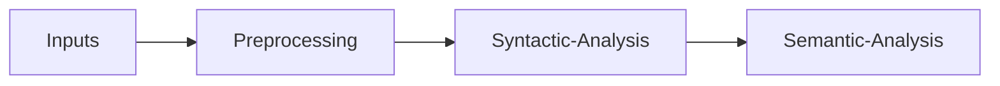

**Semantics**
$\implies$ Study of meaning and logical representation at the word level, communicating meaning with pieces of language.
It includes:
1. Understanding words and phrases.
2. General Knowledge
3. Real World Experience

 **Types of Semantics**
- **Lexical Semantics:** Study of word meaning.
- **Formal Semantics:** Study of grammatical structures and how they define meaning.
- **Conceptual Semantics:** Study of core meanings of words.
**Types of Meaning**
1. Literal Meaning: Meaning of the word itself
	 Conceptual (Dictionary) Meaning
2. Non-Literal Meaning
	Associative (Subjective) Meaning
Non-Literal Meaning such as Reservation, Uncertainty, or Sarcasm may be conveyed through:
3. Prosodic Features: Intonation, Stress
4. Paralinguistic Features: Wink, Laughter
5. Presupposition
**Figurative Use:** Metaphors

**3 levels of meaning**
1. Word level
2. Sentence level
3. Utterance (Personal/Discourse) =Sentences/Speech in context

### Semantic Roles
1. Agent
2. Patient
3. Theme
4. Experiencer
5. Beneficiary
6. Instrument
7. Goal
8. Source
### Lexical Relations

- **Hyponym/Hypernym:** (transitive)
    - **Hypernym:** Broader category: animal is a hypernym of dog
    - **Hyponym:** Specific instance: dog is a hyponym of animal
- **Polysemy/Homonymy:**
    - **Homonyms:** Unrelated meanings of the same form: lead as metal and verb
    - **Polysemy:** Related meanings of a single lexeme: mouse as animal and computer device
- **Meronymy:** Part of whole: door is a meronym of house
- **Synonyms:** Lexemes that can be substituted for each other 
- **Antonyms:** Opposites ex. hot v cold

**Types of Semantic Change:**
- **Narrowing:** Word meaning becomes more specific (e.g., "hound").
- **Broadening:** Word meaning becomes more generalized (e.g., "business").
- **Amelioration:** Word acquires a more positive meaning (e.g., "nice").
- **Pejoration:** Word acquires a more negative meaning (e.g., "silly").
- **Semantic Reclamation:** Reclaiming a word by oppressed groups (e.g., LGBT community reclaiming certain terms).

**Causes of Semantic Change**
1. Extralinguistic
	1. Psychological: Ex. lavatory, washroom
	2. Sociocultural: Ex. meaning of "engine" narrowed because of industrialization 
	3. Cultural/Encyclopaedic: (trends) legit, literally
2. Linguistic

**Semantic Analysis**
Syntax (context) is important. It influences both word and sentence meanings. 

### Lesk
WSD Algo which relies on the correct senses having some shared vocab.
**Improvements**
1. Repetition
2. Enhanced Window Context
3. Semantic Similarity
4. POS Tags consideration 
5. Stop Words Removal
6. Morpho-syntactic consideration

|**Aspect**|**Original Lesk**|**Adapted Lesk**|**M-Lesk (Modified Lesk)**|**Knowledge-based Lesk**|
|---|---|---|---|---|
|**Context**|Limited to immediate sentence|Expanded context window|Expanded context, more tokenization techniques|Expanded, plus semantic relations|
|**Synonyms/Related Words**|Not included|Basic context expansion|Synonyms and related words not considered|Incorporates WordNet relations|
|**Stop Words**|Not removed|Not removed|Stop words removed, stemming/lemmatization used|Stop words removed, WordNet relations used|
|**Similarity**|Based on exact word overlap|Exact word overlap|Preprocessing improves overlap quality|Leverages WordNet and semantic similarity|
|**Semantic Relations**|None|Limited context extension|None|Uses synonyms, hypernyms, antonyms, etc.|

### **First-Order Logic (FOL)**

**First-Order Logic (FOL)**, also known as **Predicate Logic**, is a formal system used to represent relationships between objects, properties, and functions. It plays a crucial role in knowledge representation, theorem proving, and natural language understanding (NLU). FOL builds upon propositional logic by introducing **quantifiers** (e.g., "∀" for "all" and "∃" for "exists") and **predicates** to express properties and relationships, allowing the expression of complex statements like "There exists a car that I own" (`∃x (Car(x) ∧ Owns(I, x))`).

**Logical Representation of Sentence Meaning**
Semantic parsing maps natural language into formal representations, enabling systems to process linguistic meaning precisely. For instance, "I have a car" in FOL can be represented as `Has(I, Car)` or `∃x (Car(x) ∧ Owns(I, x))`. Such representations are critical for systems like NLU and question answering.

 **Key Requirements for Semantic Representations**
1. **Verifiability**: Systems must verify sentences against a knowledge base (e.g., `Serves(Maharani, VegetarianFood)`).
2. **Unambiguous Representation**: Contexts should resolve into clear meanings, avoiding ambiguity.
3. **Canonical Form**: Different phrasings that convey the same meaning should map to the same representation.
4. **Inference and Variables**: The system should draw conclusions, like inferring that vegetarians can eat at Maharani from `Serves(Maharani, VegetarianFood)`.
5. **Expressiveness**: The system must model a wide variety of complex natural language utterances.

**Applications**
1. **Automated Theorem Proving**: Used in verifying proofs and software.
2. **Knowledge Representation**: Structured in AI, such as ontologies.
3. **Natural Language Processing (NLP)**: FOL helps formalize sentence semantics.
4. **Database Queries**: Powers query languages like SQL.
5. **AI Reasoning**: Facilitates planning and decision-making.

**Limitations**
FOL struggles with expressing higher-order concepts, dynamic changes, and uncertainty without extensions like **Probabilistic Logic** or **Fuzzy Logic**. Large knowledge bases also present performance challenges.

In essence, FOL is a powerful system for representing and reasoning about language meaning, though its limitations in handling uncertainty and dynamism require specialized extensions for broader applications.

| Category           | Algorithm                 | Purpose                                          | Key Concepts/Formula                                                                                                    |
| ------------------ | ------------------------- | ------------------------------------------------ | ----------------------------------------------------------------------------------------------------------------------- |
| **Classification** | Naive Bayes               | Predicts class probabilities                     | $P(A\mid B)=\frac{P(B\mid A)\cdot P(A)}{P(B)}$                                                                          |
|                    | Decision Trees            | Binary tree structure for classification         | Each branch is a binary decision; leaves are class labels.                                                              |
|                    | Random Forest             | Ensemble of decision trees                       | Majority voting among $n$ decision trees for final classification.                                                      |
|                    | K Nearest Neighbors (KNN) | Classifies based on nearby points                | Looks at $K$ nearest neighbors to determine the most frequent class.                                                    |
|                    | Support Vector Machines   | Finds the optimal hyperplane to separate classes | Maximizes distance from support vectors (boundary points).                                                              |
|                    | Logistic Regression       | Models binary outcomes                           | Uses an S-curve to determine threshold for classifying as $0$ or $1$.                                                   |
| **Clustering**     | K-Means                   | Finds patterns in data                           | 1. Choose $K$ random centroids. 2. Assign points to nearest centroid. 3. Update centroids. 4. Repeat until convergence. |
| **Regression**     | Linear Regression         | Predicts continuous values                       | Approximates the line of best fit, minimizing error across all data points.                                             |

| Knowledge Source Class | Code | Description                                                                                            | Example                                                                          |
| ---------------------- | ---- | ------------------------------------------------------------------------------------------------------ | -------------------------------------------------------------------------------- |
| Syntactic              |      | Knowledge based on syntactic structure, POS tagging, and subcategorization                             |                                                                                  |
|                        | K1   | POS Tags: Identifies part of speech                                                                    | I beat it (verb) vs The beat was cool (noun)                                     |
|                        | K2   | Morphosyntax: Uses morphological markers to determine syntactic structure                              | She went fishing (-ing clarifies the verb)                                       |
|                        | K3   | Collocation: Fixed expressions where words together create meaning different from the individual parts | She kicked the bucket (idiom)                                                    |
|                        | K4   | Subcategorization: Identifies transitive/intransitive verb usage and argument structure                | He runs fast (intransitive) vs He runs a business (transitive)                   |
| Semantic               |      | Word meaning, frequency, associations, and preferences                                                 |                                                                                  |
|                        | K5   | Word Frequency: Common words might influence meaning                                                   |                                                                                  |
|                        | K6   | Semantic Word Relations: Word relations such as paradigmatic and syntagmatic                           |                                                                                  |
|                        | K6a  | Paradigmatic Relations: Words that can substitute each other                                           | car vs vehicle                                                                   |
|                        | K6b  | Syntagmatic Relations: Words that co-occur in the same context                                         | drive and car                                                                    |
|                        | K7   | Selectional Preferences: Words restricting each other's meaning in a given context                     | John drove the stake into the ground (drive is restricted by stake and ground)   |
|                        | K8   | Semantic Roles: Thematic roles such as agent, theme, etc.                                              |                                                                                  |
| Pragmatic (Topical)    |      | Based on world knowledge, domain-specific information, and topical associations                        |                                                                                  |
|                        | K9   | Domain: Explicit domain representation                                                                 | Medical, Legal, etc.                                                             |
|                        | K10  | Topical Word Association: Implicit representation of topics                                            | Money is associated with bank                                                    |
|                        | K11  | Pragmatics: World knowledge and reasoning                                                              | River bank vs bank deposit (world knowledge disambiguates the meaning of "bank") |

1. Hyponym : Finer Category
2. Hypernym : Broader Category
3. Meronym : Part of Whole
4. Homonym : unrelated meanings
5. Polysemous : related meanings
6. Synonym : same meaning
7. Antonym : different meaning

8. Amelioration
9. Pejoration
10. Narrowing
11. Broadening
12. Reclamation

13. POS Tags
14. Morphosyntax
15. Collocation
16. Subcategorization
17. Repetition
18. a. Paradgimatic b. Syntagmatic
19. Selectional Preferences
20. Semantic Roles
21. Explicit Domain
22. Implicit Domain
23. Real World Knowledge

24. Verifiability
25. Unambiguity
26. Canonical Form
27. Inference and Variables
28. Expressiveness

29. Agent
30. Patient
31. Theme
32. Beneficiary
33. Experiencer
34. Instrument
35. Source 
36. Goal

37. Naive Bayes
38. Logistic Regression
39. K nearest neighbours
40. Support Vector Machines
41. Decision Tree
42. Random Forest
43. K Means
44. Linear Regression

45. Repetition
46. Enhanced Window Context
47. Semantic Similarity
48. POS Tags consideration 
49. Stop Words Removal
50. Morpho-syntactic consideration
### **Zipf's Law and Zipfian Distribution:**

$f(w)=\frac C {r(w)^a}$

**Mandelbrot's Law**
$f(w)= \frac C{(r(w)+b)^a}$

**Word Identification:**
- Words can be identified at different levels:
  - *Graphical word (token)*: Based on surface properties like characters and spaces.
  - *Underlying word (stem, root)*: Requires morphological analysis.
  - Words are indivisible sequences of characters with meaning and can be reused.

**Indivisibility:**
- Words can be composed of smaller parts (derivations, compounds), but "atomicity" is relative.
- Examples: *colourless* (colour + -less), *database* (data + base).

**Reusability:**
- Words enter the lexicon but can also be created on the fly.
- Many words are rare; 50% of words in a novel may appear only once (hapax legomena).

**Tokenization and Problems:**
- Tokenization breaks text into words and is crucial for NLP.
- Challenges include handling whitespace (non-existent in some languages), non-alphanumeric characters, and hyphenated compounds.

**Types and Tokens:**
- *Token*: Every word occurrence in a text.
- *Type*: Unique words in a text.
- Example: "I spoke to the chap who spoke to the child" has 10 tokens and 7 types.

**Frequency Analysis:**
- *Type-Token Ratio (TTR)*: Measures word frequency.
  - Larger corpora show lower TTR as frequent words repeat.
- Frequency lists rank words by their occurrence, with common words dominating (e.g., "the," "and").

**Word Distributions and Zipf's Law:**
- A few words occur frequently, while many occur rarely (Zipf's Law).
- Zipf’s law predicts that word frequency decreases exponentially with rank:
  - 2nd most frequent word ≈ 1/2 of the most frequent.
  - 20th most frequent ≈ 1/20 of the most frequent.
- Frequency differences at high ranks are large, while they are smaller at low ranks.
- Zipf’s law applies in other domains (e.g., income distribution).

**Mandelbrot’s Law:**
- An extension of Zipf’s law, adjusting for high-frequency words by adding a constant to the rank.

**Implications of Zipfian Distributions:**
- Data sparsity: Most words in a corpus are rare.
- Vocabulary is inexhaustible: Larger corpora will always introduce new, rare words.

**Explanation:**
- Zipf suggested the “least effort” principle: speakers minimize effort by using common words, while listeners prefer clarity through a larger vocabulary.

**Bayes Law**

$$P(s\mid c) = \prod _{i=1}^n P(w_i\mid c)$$ $$\hat c = argmax _{c_j\in C} P(d\in c_j) \prod _{i=1}^{|d|} P(w_i\mid c_j)$$
Before Laplace smoothing, $$P(w|c)=\frac { n(w \in c)} {n(w\in V)}$$
$|V| =$ number of unique types in the training vocabulary.

After Laplace smoothing, $$P(w|c)=\frac { n(w \in c) + 1} {n(w\in V) + |V|}$$

1. 
**Herdan's Law** *(Heap's Law)*
$V = kN^\beta$
if $\beta = 0.7$, which is standard for English, what is $k?$

$k =\frac {V}{N^\beta}$

2. 
$f(k;s,V)=\frac{(\frac1{k^s})}{\sum _{n=1}^V\frac1{n^s}}$
This is the predicted relative frequency.
where
$k$ is the rank
$s$ is the exponent
$V$ is the size of the vocabulary
Take $s=1$. Calculate the PRF of the following:
$f(k;s,V)=\frac{(\frac1{k})}{\sum _{n=1}^V\frac1{n}}$

**Semantic Roles** (*FrameNet*)
1. Agent
2. Patient
3. Theme
4. Experiencer
5. Beneficiary
6. Instrument
7. Goal
8. Source

**Semantic Roles** (*PropBank*)
Every verb sense usually has its own set of possible arguments to the verb, unlike FrameNet which has a generalised set of Thematic Roles.
Arg0 is generally the doer or causer.
Arg1 is generally the thing done or the experiencer.

![[Pasted image 20241128193134.png]]

| **Aspect**           | **PropBank**                                 | **FrameNet**                                   |
| -------------------- | -------------------------------------------- | ---------------------------------------------- |
| **Focus**            | Verb-oriented.                               | Frame-oriented (verbs, nouns, related words).  |
| **Annotation Scope** | Annotates all verbs in a corpus.             | Selects example sentences from a corpus.       |
| **Approach**         | Syntactic-level annotations.                 | Semantically motivated annotations.            |
| **Noun Coverage**    | Does not include nouns for events/states.    | Includes nouns and related words.              |
| **Training Use**     | Designed for machine learning role labeling. | Designed for linguistic and semantic analysis. |
| **Ease of Labeling** | Easier due to syntactic focus.               | More complex due to semantic scope.            |
| **Roles Assigned**   | Proto Roles                                  | Frame Specific Roles                           |

**ArgM** (*Modifying arguments*)
1. LOC: location 
2. EXT: extent 
3. CAU:cause 
4. TMP: time 
5. DIS: discourse connectives 
6. PNC: purpose 
7. ADV: general-purpose 
8. MNR: manner 
9. NEG: negation marker 
10. MOD: modalverb 
11. DIR: direction

**Binding Theory**
$A$ is considered to be bound to $B$ if and only if $B$ c-commands $A$ and they refer to the same entity.
1. Every anaphor must be bound in its binding domain. (*Principle A*)
2. Every pronoun must be free in its binding domain. (*Principle B*)
3. Every R-Expression (*Referential Expression*) must be free. (*Principle C*)

**Vectors**
Zipf's Law
$f(r)\propto \frac1r$
Bag of Words
Represent a sentence or document as the words it is made of and their frequencies.
Each document can thus be stored in a binary array of length n, where n is the number of unique words, and a 1 indicates presence, and 0 absence of that word.

**TF-IDF**
$tf(t) = \frac{f_t}{\sum_{t'}f_{t'}}$ where $f_x$ is the number of times $x$ occurs in that document
$idf(t) = \ln{\frac N{|\{d|t\in d\}}|}$  which is the inverse of the number of documents in which that term is present
$tfidf(t) = tf(t)\cdot idf (t)$
Accounts for sparsity.
Does not account for
1. Position of words
2. Relationships between co-occurring words
3. Meanings of words
![[Pasted image 20241129003810.png]]![[Pasted image 20241129003831.png]]
**Word Embeddings**
1. Word2Vec: Learns embeddings by a certain context window and predictions
2. GloVe: Factorizes the cooccurence matrix
3. FastText: stores each words as a Bag of Character n-grams
Vector Math
$\vec {queen} = \vec {king} - \vec {man} + \vec {woman}$

Embeddings do not account for:
1. Rare words
2. Word order
Contextualised Embeddings
1. ELmO: *Embeddings from Language Models*
2. BERT: *Bidirectional Encoder Representations from Transformers*

**Distributional Hypothesis**: _words occurring in similar contexts have similar meanings_ (Contexual Similarity)

Word 2 Vec

| **Aspect**                 | **CBOW (Continuous Bag of Words)**                                          | **Skip-gram**                                                               |
| -------------------------- | --------------------------------------------------------------------------- | --------------------------------------------------------------------------- |
| **Objective**              | Predicts the target word (center word) given the surrounding context words. | Predicts the context words given the target word (center word).             |
| **Focus**                  | Averages the representations of context words.                              | Focuses on learning better representations for rare words.                  |
| **Training Efficiency**    | Faster since it processes multiple words simultaneously.                    | Slower as it generates predictions for each context word individually.      |
| **Handling of Rare Words** | Less effective since rare words may appear less often in contexts.          | Better as it focuses more on individual words and their contexts.           |
| **Use Case**               | Suitable for smaller datasets or tasks requiring efficient computation.     | Better for large datasets and capturing relationships involving rare words. |

**CBOW** (Continuous bag of words)
$P(w_t \mid C) = \exp({(v_{w_t}^\top h) - \sum_{w \in V} (v_w^\top h)})$
$h = \frac{1}{|C|} \sum_{w \in C} v_w$

**Skipgram**
$P(w_c \mid w_t) = \exp(v_{w_c}^\top v_{w_t} - \sum_{w \in V} (v_w^\top v_{w_t}))$

![[Pasted image 20241129000150.png]]

**Cosine Similarity**
$similarity(a,b) = \frac{a\cdot b}{|a|\cdot |b|}$

**RST (Rhetorical Structure Theory)**
**Units of discourse** Texts can be segmented into minimal units, or spans 
**Nuclearity** Some spans are more central to the text’s purpose (nuclei), whereas others are secondary (satellites) Based on hypotactic and paratactic relations in language 
**Relations among spans** Spans are joined into discourse relations 
**Hierarchy**/recursion Spans that are in a discourse relation may enter into new relations

**Schemas**
![[Pasted image 20241128204004.png]]
![[Pasted image 20241128204045.png]]![[Pasted image 20241128204100.png]]

**Centering Theory**
1. Forward Looking Center is a partially ordered list of items in $U_n$ by decreasing saliency (subject > direct object > ...)
2. Backward Looking Center of ($U_n$) is the highest ranked entity in $U_{n-1}$ which is also mentioned in the $U_n$. Where $U_{n-1}$ is the immediately preceding utterance. 
**Constraints**
1. If any entity in $FW(U_{n-1})$ is realised a pronoun in $U_n$, then $BW(U_n)$ has to be realised as a pronoun in $U_n$.
2. Center continuation > Center retaining > Center shifting

Center Continuation: $FW(U_n) = FW(U_{n-1}), BW(U_n) = BW(U_{n-1})$ 
Center Retaining: $FW(U_n) \neq FW(U_{n-1}), BW(U_n) = BW(U_{n-1})$ Center Shifting: $FW(U_n) \neq FW(U_{n-1}), BW(U_n) \neq BW(U_{n-1})$ 

**Hobb's Algorithm for pronoun resolution**
(bfs) Go upwards and downwards from left to right, the first valid entity you arrive at is most likely the correct pronouns.