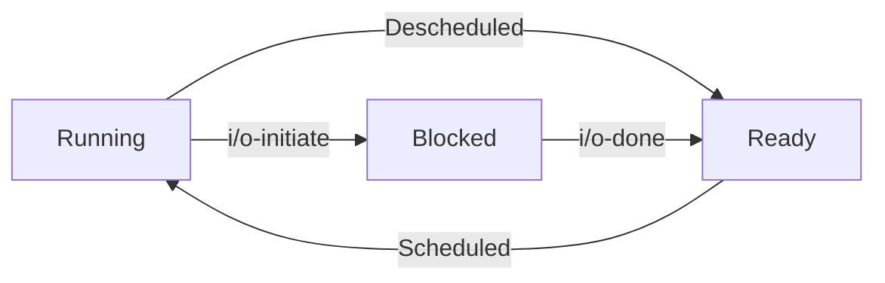

**Process**
A process is a running programme.
**What constitutes a process?**
1. Unique Id: Process ID
2. Memory Image
	1. Static: Code and Data
	2. Dynamic: Stack and Heap
3. CPU Context: Registers (to store current process so that we can return after and through context switches)
	1. PC
	2. Current Operands
	3. Stack Pointer
4. File Descriptors: Pointers to open files and devices

**Main Steps for Creation of Process**
1. Load Programme
	1. Programme resides in the disk.
	2. OS does lazy loading (load only that which is required) into the memory
2. Allocate Runtime Stack
	1. For local variables and 
3. Creation of Programme Heap
	1. Used for dynamically allocated data (`malloc()` and `free()`)
4. Basic File Setup
	1. Stdin, Stdout, Stderr
5. Initialise CPU Registers
	1. PC to the first instruction
6. Start the programme


**States of the Process**
 1. Running
 2. Ready
 3. Blocked (not ready to run, ex. i/o call)



In the i/o call, there is **DMA** (direct memory access), that is, the memory is accessed without the CPU.

**How to store Metadata?**
The OS stores all the metadata of a process in a *Process Cotnrol Block* or PCB, and stores the PCBs in a list called the *Process List*.


**Xv6 OS**
It is a replicate basic Unix, developed as a teaching OS by MIT.


**Explanations**
How can the OS make the process feel like it has exclusive access to the CPU?

The OS switches between the processes, and to enable this, the only virtualization required is that when the OS switches between two processes, the data of the previous process should not be lost.

There is a bus connecting all the components, and the farther the component is from the CPU, the more time it takes to access. Ex. Hard Disk takes more time than Memory. The closer it is, the costlier it is.

**Superscalar CPU**
Allows multiple fetch, decode, or execute to be running simultaneously through a holding buffer.

The time is maintained by the hardware. That is, after $n$ seconds of time, the next process must run. -> low level mechanisms (Context Switch) 
However, it is the software (OS) which decides which is the next process through algorithms and intelligence. -> policies (CPU Scheduler)


**Features OS should provide**
1. Create a new process
2. Destroy a process (force quit)
3. Wait before running
4. Suspend in the middle of a process
5. Status of a current process

**API** (Application Programming Interface)
It is a software interface with detailed documentation that another software can use.
The APIs available for the user programme to interact with the OS are called system calls.
Ex. Process Management, Memory Management, I/O Management, File Management, etc.
The user cannot directly access any part in the memory, or directly access the hardware. These APIs have functions that call directly into the OS code.

There are two modes of execution: User mode and Kernel mode. syscalls and some other operations can only be done in Kernel mode, because you are directly accessing the hardware.

**POSIX API** (Portable Operating Systems Interface)
To be compliant to a certain standard and allow portability, every OS must include certain system calls.
Ex. `printf()` invokes `write()` in c


There are four main syscalls for processes.

| syscall  | usage                                                           |
| -------- | --------------------------------------------------------------- |
| `fork()` | forks into a parent (original) and child (replicated) processes |
| `exec()` | creates a new process                                           |
| `wait()` | the parent process is blocked until the child terminates        |
| `exit()` | to terminate a process                                          |
parent and child processes execute and modify memory independently.
without wait, the child process terminates into a zombie process (exit status not collected by parent),  and the os resources are not reclaimed by the parent.


When a process calls upon a system call, it cannot merely push that into the stack. This is because then the process would have access to the OS code.
It is for this reason that there exist a separate User mode and Kernel mode. It is the CPU (processor) that is responsible for this switch.
When a process calls upon a system call, the process will be trapped into the Kernel mode. That is, the trap instruction will be called, and it will only come back into User mode upon the return of trap.


| User mode                                       | Kernel Mode                                |
| ----------------------------------------------- | ------------------------------------------ |
| Code is restricted                              | Code can do anything                       |
| No i'/o requests, processor raises an exception | All privileged operations can be executed. |

There is hence a separate Kernel stack. Every process has a separate Kernel stack. It points directly to the code in the Kernel.

**IDT** (Interrupt Descriptor Table/ Trap Table)
It is a look up table which stores the IDs and addresses. Every time the system boots, it prepares this table.
Every time a system call happens, the OS uses trap instruction, and looks up the ID of which trap was used. Then, once the corresponding code is executed from the address it was stored in, then it returns from trap back into the User mode.

**Interrupt Causes** (can be hardware or software reasons)
1. Syscalls
2. Exception: error in code like divide by zero
3. I/O interrupt
4. Timer based interrupt: (clock interrupt) interrupt every 'n' milliseconds
5. Bad memory interrupt: tries to access bad memory
6. Segmentation fault interrupt: tries to access memory without access
7. Network interrupt
8. Console interrupt


**Switching between process**

| Non Preemptive Approach                                                                                                          | Preemptive Approach                                                                                          |
| -------------------------------------------------------------------------------------------------------------------------------- | ------------------------------------------------------------------------------------------------------------ |
| OS trusts the processes to give back control (`yield()`).                                                                        | OS has a timer interrupt.                                                                                    |
| If the process misbehaves, then the only solution is to reboot. If it refuses to give back control for whatever reason, that is. | Every 'x' milliseconds, raise an interrupt, halt the process, invoke interrupt handler, OS regains controls. |
| Assumes cooperation.                                                                                                             | Accounts for non-cooperation.                                                                                |

**Context Switch**
Low level piece of assembly code, which allows for seamlessly switching between processes by saving some important information, especially that in registers.

**OS**
It works on 3 pillars:
1. abstraction of memory and processes. (virtualization)
2. concurrency of multiple processes
3. persistence of memory (disk i/o)
**Process**
An abstraction for a running programme.
UID, Memory(code+data lazily loaded, runtime stack+ dynamically allocated heap), Registers (operands, Instruction Pointer, PC, Stack Pointer), Persistent Storage (i/o file descriptors, disk)
![[Pasted image 20240826011835.png]]
Processes are stored in a list of PCBs (process control blocks)
**OS**
Allocate and manage system resource.
![[Pasted image 20240824225645.png]]

Low Level Mechanisms like Context Switches
and
High Level Policies like Scheduling Policies

![[Pasted image 20240825232311.png]]

**Networking**
How can processes in different systems communicate?
Hosts are servers or clients.
Addresses are IP addresses of 32 bits  in 4 parts. Client sends both source and destination IP.
**Repeater**
To enhance signal strength.
**Hub**
Repeats the signal to all ports (multi port repeater)
**Bridge**
Connect two hubs
**Switch**

| Repeater         | Hub                 | Bridge                                                    | Switch                                                                                  | Router                                                                     |
| ---------------- | ------------------- | --------------------------------------------------------- | --------------------------------------------------------------------------------------- | -------------------------------------------------------------------------- |
| Amplifies Signal | Multi port repeater | Reads source and destination, single input, single output | Can detect error and reject packets, multi-port bridge, forwards data to specific ports | A switch that routes packets based on IP, typically connect WLANS and LANS |
| Physical Layer   | Physical Layer      | Data Link Layer                                           | Data Link Layer                                                                         | Network Layer                                                              |


**Personal Area Network** PAN
very short range
Ex. Bluetooth

**Local Area Network** LAN
small area ex. building, school, home etc.

**Metropolitan Are Network** MAN
City wide
Ex. TV network antennae

**Wide Area Network** WAN
Country wide etc.


Physical Layer: $L_1$
The actual hardware transporting binary data
Data Link Layer $L_2$
Directly connected hop-to-hop systems (MAC addresses 48 bits)
Network Layer $L_3$
Managing routing (IP Addresses 32 bits)
Transport Layer $L_4$
Addressing scheme between ports, these are the protocols for communication.
Session Layer $L_5$
Establishing, maintaining, and terminating connections
Presentation Layer $L_6$
Format, data encryption, compression
Application Layer $L_7$
Network services for application processes

![[Pasted image 20240826014446.png]]MUX DEMUX

![[Pasted image 20240826014721.png]]

### **14 Memory API**
The following functions are used:
```C
void *malloc(size_t size);
void free(void *ptr);
void *calloc(size_t nmemb, size_t size);//initializes nmemb blocks of size size to zero
void *realloc(void *ptr, size_t size);//increases size of bloc to size
sizeof(int);//it is a compile time operator
```
**Errors in Memory Allocation**
1. Not Allocating Memory
2. Not Allocating Enough Memory (*Buffer Overflow*)
3. Not Initializing Allocated Memory 
4. Not Freeing Allocated Memory (*Memory Leak*)
5. Accessing Freed Memory
6. Freeing Memory Multiple Times (Undefined)
7. Incorrectly Freeing Memory (*Invalid Frees*) 
Using `valgrind` or `purify` help you locate the source of memory leak.
**System Calls**
The following system calls are used for memory management.
`brk`(takes a pointer to new break): changes location of end of heap (increase or decrease heap size)
`sbrk`(increments heap size): same function as `brk`, but takes different argument
`mmap()`: creates an anonymous memory in swap space

### **15 Address Translation**
How to efficiently virtualize memory?


### **18 Paging**
![[Pasted image 20240924102821.png]]
P: Present (or swapped in disk)
R/W: Read Write
U/S: User Supervisor
A: Accessed (Reference Bit)
D: Dirty
Rest: Caching

```C
VPN = (VirtualAddress & VPN_MASK) >> SHIFT 
PTEAddr = PageTableBaseRegister + (VPN * sizeof(PTE))
offset = VirtualAddress & OFFSET_MASK 
PhysAddr = (PFN << SHIFT) | offset
```

```C
// Extract the VPN from the virtual address 
VPN = (VirtualAddress & VPN_MASK) >> SHIFT 
// Form the address of the page-table entry (PTE) 
PTEAddr = PTBR + (VPN * sizeof(PTE)) 
// Fetch the PTE 
PTE = AccessMemory(PTEAddr) 
// Check if process can access the page 
if (PTE.Valid == False) 
	RaiseException(SEGMENTATION_FAULT) 
else if (CanAccess(PTE.ProtectBits) == False) 
	RaiseException(PROTECTION_FAULT) 
else 
	// Access OK: form physical address and fetch it 
	offset = VirtualAddress & OFFSET_MASK 
	PhysAddr = (PTE.PFN << PFN_SHIFT) | offset 
	egister = AccessMemory(PhysAddr)
```


### **19 TLB**
```C
VPN = (VirtualAddress & VPN_MASK) >> SHIFT 
(Success, TlbEntry) = TLB_Lookup(VPN) 
if (Success == True) 
	// TLB Hit 
	if (CanAccess(TlbEntry.ProtectBits) == True) 
		Offset = VirtualAddress & OFFSET_MASK 
		PhysAddr = (TlbEntry.PFN << SHIFT) | Offset 
		Register = AccessMemory(PhysAddr) 
	else RaiseException(PROTECTION_FAULT) 
else 
	// TLB Miss 
	PTEAddr = PTBR + (VPN * sizeof(PTE)) 
	PTE = AccessMemory(PTEAddr) 
	if (PTE.Valid == False) 
		RaiseException(SEGMENTATION_FAULT) 
	else if (CanAccess(PTE.ProtectBits) == False) 
		RaiseException(PROTECTION_FAULT) 
	else 
		TLB_Insert(VPN, PTE.PFN, PTE.ProtectBits) 
		RetryInstruction()
```

TLB is a fully associative cache with each entry like: VPN | PFN | other bits

During a context switch, either flush whole TLB (expensive) or maintain an Address Space Identifier in the TLB entry. Also has a G (global bit) if a page is universally shared (Ex. r-x code). Also has a dirty bit, and a valid bit (if there is a valid translation).
Replacement Policy: LRU or Random is good.

4 privileged instructions
`TLBP` probe tlb for some entry
`TLBR` read an entry into the registers
`TLBWI` replace specific entry
`TLBWR` replace random entry

### **20 Smaller Page Table**

**Segmentation Hybrid**
```C
SN = (VirtualAddress & SEG_MASK) >> SN_SHIFT // Segment 
VPN = (VirtualAddress & VPN_MASK) >> VPN_SHIFT
AddressOfPTE = Base[SN] + (VPN * sizeof(PTE))
```
Problem: Internal Fragmentation Again
**Multi Level Page Tables**
Solves Internal Fragmentation by Page Table Directory (Page Table for Pages of Page Table).
Increases complexity and time space trade off in case of TLB Miss takes more time than before.

```C
PDEAddr = PageDirBase + (PDIndex * sizeof(PDE))
```
![[Pasted image 20240924112937.png]]
Or multiple indices
![[Pasted image 20240924113152.png]]

```C
VPN = (VirtualAddress & VPN_MASK) >> SHIFT (Success, TlbEntry) = TLB_Lookup(VPN) if (Success == True) // TLB Hit if (CanAccess(TlbEntry.ProtectBits) == True) Offset = VirtualAddress & OFFSET_MASK PhysAddr = (TlbEntry.PFN << SHIFT) | Offset Register = AccessMemory(PhysAddr) else RaiseException(PROTECTION_FAULT) else // TLB Miss // first, get page directory entry PDIndex = (VPN & PD_MASK) >> PD_SHIFT PDEAddr = PDBR + (PDIndex * sizeof(PDE)) PDE = AccessMemory(PDEAddr) if (PDE.Valid == False) RaiseException(SEGMENTATION_FAULT) else // PDE is valid: now fetch PTE from page table PTIndex = (VPN & PT_MASK) >> PT_SHIFT PTEAddr = (PDE.PFN<
```

Inverted Page Tables

![[Pasted image 20240924121700.png]]


Cold miss or compulsory miss (First time the page is being brought)
Capacity Miss (no space available)
Conflict miss (space available, but for different purpose, set associative, not fully associative)

**Spatial Locality**
When a page is accessed, the pages around it are more likely to be accessed in the near future.

**Temporal Locality**
When a page is accessed, it is likely to be accessed again in the near future.
**Policies for Page Replacement**
LRU, LFU (Recently, frequently)
FIFO, Random
MRU, MFU (Idiotic)

Consider dirty (expensive), and reference (likely to be needed) bits
Clustering, grouping of writes
demand fetching vs prefetching

Thrashing: too many process, too much paging
1 solution is to admission control (reduce workload), just stop running some processes
Another is to kill the most memory intensive process. However, this may affect many other processes dependent on it
**CHATGPT**
Here are key definitions and concepts extracted from the passage:

1. **Operating System (OS)**: Software that makes computer systems easy to use, handling processes such as CPU and memory virtualization, concurrency, and persistence. It provides protection between running programs and allows users to secure their files.

2. **Process**: The most basic abstraction of the OS, a process is simply a running program. Processes involve mechanisms to execute them and policies to schedule them efficiently.

3. **CPU Virtualization**: A set of techniques that allow the OS to manage CPU resources, ensuring programs can run efficiently while limiting their capabilities through restricted modes and OS intervention. This is referred to as **limited direct execution**, where the OS controls hardware to restrict processes and only intervenes for privileged operations or when necessary.

4. **Process APIs (UNIX)**: APIs like `fork()`, `exec()`, and `wait()` are used to create and manage processes in UNIX. The process creation API `fork()` has been criticized in some research for its complexity, with alternatives like `spawn()` suggested.

5. **Scheduler**: The component of the OS that decides which process should run at any given time. There are different approaches to scheduling:
   - **Shortest Job Remaining**: Optimizes turnaround time by running the shortest job first.
   - **Alternating Jobs**: Optimizes response time by switching between jobs.

6. **I/O Integration in Scheduling**: Incorporates input/output operations into scheduling decisions, though the OS cannot predict future needs perfectly.

7. **Multi-Level Feedback Queue (MLFQ)**: A scheduling algorithm that uses past behavior to predict future needs and optimize process scheduling.

Here are key definitions and points extracted from the passage:

### Key Definitions:
1. **Multi-Level Feedback Queue (MLFQ)**: A scheduling algorithm that uses multiple levels of queues and adjusts a job’s priority based on its behavior over time. It observes job execution and dynamically adjusts priorities to optimize both short-running interactive jobs and long-running CPU-intensive workloads.
   
2. **Proportional-Share Scheduling**: A scheduling approach that allocates CPU resources based on proportions, with different methods like:
   - **Lottery Scheduling**: Uses randomness to allocate CPU time based on ticket proportions.
   - **Stride Scheduling**: Uses deterministic methods to allocate resources.
   - **Completely Fair Scheduler (CFS)**: The default Linux scheduler, which uses a weighted round-robin system with dynamic time slices to balance load and scalability.

### MLFQ Rules:
1. **Rule 1**: Higher priority jobs always run before lower priority ones.
2. **Rule 2**: Jobs of the same priority run in round-robin fashion.
3. **Rule 3**: New jobs are placed at the highest priority (topmost queue).
4. **Rule 4**: If a job exhausts its time at a level, its priority is reduced (moves to a lower queue).
5. **Rule 5**: After a set time (S), all jobs are moved to the topmost queue.

### Key Points:
- **MLFQ** adjusts priority based on historical execution, offering optimal performance for both short interactive jobs and long-running tasks.
- **Proportional-Share Schedulers** are useful in domains like cloud computing, where resources can be allocated based on shares (e.g., splitting CPU between virtual machines).
- **Fair-Share Scheduling Issues**: They may not handle I/O jobs well and face challenges with ticket/priority assignment. MLFQ and other general-purpose schedulers automatically address these issues.
### Key Definitions and Points:

1. **Virtual Memory**: Provides the illusion of a large, sparse, private address space to each running program, allowing each program to use virtual addresses. The OS, along with hardware, translates virtual addresses into physical addresses and manages memory protection among processes.

2. **Paging**: A memory virtualization method that divides memory into fixed-size units (pages). It avoids external fragmentation and supports sparse use of virtual memory. However, paging can slow down systems due to extra memory accesses for the page table and lead to memory waste with page tables filling up memory.

3. **Translation Lookaside Buffer (TLB)**: A small, dedicated on-chip cache for speeding up address translation. Most memory references are handled by the TLB, avoiding the need to access the page table in memory, which enhances system performance. However, **TLB misses** occur when the number of accessed pages exceeds the TLB's capacity, slowing down programs, particularly large data-intensive applications.

4. **TLB Coverage**: The amount of memory that can be managed by the TLB. When programs exceed the TLB coverage, they suffer from many TLB misses. A solution is to support larger page sizes, especially for applications like databases with large, randomly accessed data structures.

5. **Page Tables**: Data structures used to map virtual addresses to physical addresses. Different types of page tables offer trade-offs between time and space efficiency. Small structures work better in memory-constrained systems, while larger page tables are suited for workloads that require many pages and benefit from faster TLB miss handling.

6. **Virtually Indexed Cache**: A technique where caches are accessed using virtual addresses to avoid translation delay. This can improve performance but introduces hardware design complexity.

7. **Software-Managed TLBs**: Allow flexibility in choosing page table structures. In environments with significant memory or specific workloads, creative design of page table structures can optimize TLB miss handling.

### Key Points:
- Virtual memory ensures each program has its own address space, translated by the OS.
- Paging avoids external fragmentation but must be carefully implemented to avoid system slowdowns.
- TLBs enhance paging efficiency but may bottleneck if page usage exceeds TLB coverage.
- Larger page sizes and virtually indexed caches are advanced techniques to improve memory management.
- Optimizing page tables and TLBs depends on system constraints and workload characteristics.


Threads are like processes but share memory
They have separate registers and stacks in TCBs (Thread control blocks), but share the same address space and memory
If the output of the code depends on the timing of execution of the threads, then we say race conditions have occured
We want mutual exclusion, that is, two threads cannot access some memory during the critical section, which is the code which causes the race conditions
One solution is synchronization primitives, which are certain operations that are guaranteed to be primitive

![[Pasted image 20241121154349.png]]![[Pasted image 20241121154405.png]]


![[Pasted image 20241121154437.png]]![[Pasted image 20241121154543.png]]![[Pasted image 20241121154554.png]]![[Pasted image 20241121154616.png]]


```c
pthread_mutex_init(&lock, NULL);
pthread_mutex_destroy(&lock);
pthread_cond_init(&cond, NULL);
pthread_cond_destroy(&cond);
```


**Locks**

How to build locks?
1. We can just disable interrupts -> dumb, trusts processes
2. Maintain it as a flag (0 -> empty, 1 -> occupied) -> lock and unlock themselves are critical-> not feasible, performance -> spin wasting
3. Do 2, but with minimal hardware primitive test and set, thus lock and unlock are atomic -> **spin lock** (requires preemptive scheduling)
4. Hardware Primitive: Compare and Swap: compare expected and actual, and if it is the equal, then set to new 
5. Load linked, store conditional (atomic store conditional)
6. Fetch and add (atomic increment)
7. Ticket lock: Atomic increment of a global variable

| Model | correctness | fairness | performance                                                    |
| ----- | ----------- | -------- | -------------------------------------------------------------- |
| 1     | No          | -        | -                                                              |
| 2     | No          | -        | -                                                              |
| 3     | Yes         | No       | Bad, spin wasting                                              |
| 4     | Yes         | No       | "                                                              |
| 5     | Yes         |          | "                                                              |
| 6     | Yes         |          | "                                                              |
| 7     | Yes         | Yes      | ", starvation possible if endless loop, but has a turn in line |
![[Pasted image 20241121163928.png]]![[Pasted image 20241121164105.png]]


Spinning has another problem: priority inversion, if a low priority process goes into a critical section, then a high priority process will keep spinning.
Solutions to priority inversion
1. Avoid spin locks (does not solve it)
2. Give all threads the same priority
3. priority inheritance: higher priority threads boost low priority threads in the critical section 
Solutions to spin wasting
1. Yield instead of spinning (yield = deschedule = running -> ready)
2. Park/Unpark: Have a queue for each thread to enter in to wait (sleep/relinquish), and when a thread is done, it activates the next thread in the queue. Thus, no spinning.


**Condition Variables**

How can parent wait until child is done?
1. Parent spins (spin-waste)
2. Parent sleeps (relinquishes)

cond has two things, 
1. wait() ->for one to sleep
2. signal() -> for another to tell one to wake up
![[Pasted image 20241121171320.png]]
atomically put to sleep, and reacquires lock when signalled: imp-> hold lock, use state variable, check state variable before while loop with cond as follows
![[Pasted image 20241121171621.png]]![[Pasted image 20241121171629.png]]

Producer consumer / bounder buffer problem, fixed size resource, multiple producer and consumer threads

Mesa semantics -> interpret the signal on being woken up
Hoare semantics -> thread runs immediately on being woken up

a consumer should not wake up another consumer etc.
Solution: two conds (empty and fill), consumers wake on fill, and signal empty, producers wake on empty and signal fill

pthread_cond_broadcast = pthread_cond_signal to all threads that need to be woken up.


**Semaphores**
basically just an int with atomic increment decrement
![[Pasted image 20241121203115.png]]
![[Pasted image 20241121203135.png]]


Hill's Law: big and dumb is better

Zemaphore -> value always >= 0
![[Pasted image 20241121204830.png]]


**Major Concurrency Bugs**
1. Non Deadlock
	1. Atomicity Violation (can be solved by mutex lock)![[Pasted image 20241121205138.png]]
	2. Order violation (can be solved by mutex lock + cond) ![[Pasted image 20241121205327.png]]
2. Deadlock Bugs ![[Pasted image 20241121205447.png]]

Conditions for deadlock
1. mutual exclusion: (exclusive control)
2. hold-and-wait: (they hold the control)
3. no preemption: (no forceful lock removal)
4. circular wait: (circular dependency)

Solution
1. (lock free approach) Use atomic compare and swap![[Pasted image 20241121212547.png]]
2. (avoids hold and wait) Obtain all locks at once ![[Pasted image 20241121210223.png]]
3. (avoids no preemption) (new problem: livelock, they both keep doing this routine) ![[Pasted image 20241121210359.png]]
4. (avoids circular) Total or partial order for obtaining the locks
5. Smart scheduling (a scheduler that knows not to schedule which threads together because they use the same locks)
6. Detect and recover (if deadlocks are infrequent, run a detector for deadlocks every so often and then take action to repair them)


**I/O**

Old arch:
Buses
1. Memory Bus: between CPU and memory
2. General i/o bus: Graphics, high performance i/o (PCI)
3. Peripheral Bus: Disk, mice, keyboard, etc. (USB)

Modern:
1. Memory has direct line to cpu
2. graphics card (PCIe) has direct line to cpu
3. DMI (direct media interface, proprietary intel), dmi connects cpu to i/o card, which is then connected individually to other i/o devices like through: ATA (AT Attachment), SATA (Serial ATA), eSATA (external SATA), USB (Universal Serial Bus), PCIe (Performance Component Interconnect, used for Network, high performance devices)


Canonical Device has 3 registers in the interface: status, command, and data (data to be written or read)
It is accessed through four steps of canonical protocol
1. Polling (repeatedly checking the status, until it is not busy)
2. Programmed i/o (PIO) (CPU writes to Data register)
3. OS writes the command to command register
4. Again repeated polling to check whether success or failure and wait until it is not busy again

Overlap of Computation and I/O
Instead of having an i/o process just repeat polling, we can run another process in the cpu. This is done by jumping to an interrupt service routine (interrupt handler), which allows another process to run computation, while the i/o process sleeps and does polling later.
(consider the overhead costs brought by interrupts)

DMA
another overhead is that everytime data must be read from the disk, it needs to be read word by word, consuming lot of cpu. DMA (direct memory access) solves this. An i/o process need not consume cpu time for this. While another process runs computation in the cpu, the i/o process which has completed polling can directly copy using DMA

How to actually get i/o?
1. in and out as privileged OS instructions
2. memory mapped i/o: the device are just considered as extended virtual addresses, doesn't need any additional instructions

Actual device interactions? Each device has a device driver responsible for i/o interactions with that device.

SCSI: Small Computer System Interface
SATA: Serial Advanced Technology Attachment 


**Hard Disk Drive**
It is basically an array of sectors (512 B blocks), and any read write is atomic per sector. A write may be a torn write (non atomic) only if it consists of more than one sector.
Common (valid) assumptions: accessing two nearby blocks is faster, accessing in contiguous chunks is faster
A circular disk, with two surfaces, of aluminium coated with a magentic material, which have many concentric circles which are packed very closely together.
We simply have to wait for the required sector to come under the arm, this has a rotational delay ($R$) (single track latency)


The arm must first seek the required sector (settling time)
1. Acceleration 
2. Coasting (full speed)
3. Decceleration
after seek, then transfer (actual i/o) will take place

track skew, the continuation of one concurrent circle takes place after a skew in the next circle to adjust for some delay in switching tracks during rotation

disk is divided into zones, each zone has the same number of sectors, outer zones have more, inner zones have fewer.

Caching:
write back: (immediate reporting) save into memory first, then later into disk, appears faster, more dangers
write through: save directly into disk

Therefore, the time taken is
$T_{i/o} = T_{seek} + T_{rotate} + T_{transfer}$
$R_{i/o} = \frac {Size_{i/o}}{T{i/o}}$

Compare on random vs sequential workload

Capacity (larger, slower, cheaper) vs performance (smaller, faster, more expensive) drives

Disk Scheduling: SJF Type (Shortest Job First)
1. SSTF (Shortest Seek Time)
2. NJF (Nearest Job First
may result in starvation of farther jobs
Solutions: (SCAN algorithms, aka elevator algorithms)
1. Scan: pass from in to out then out to in, insert jobs in the queue based on their position
2. FSCAN: Scan, but all jobs come in to the next queue, i.e, a queue is frozen before starting it
3. CSCAN: to prevent favouring middle jobs, go from out to in, then reset back to out, no going backwards

SPTF: Shortest Positioning Time First (Seek + Rotate)
SATF: Shortest Access Time First1

i/o merging: consider 33 8 34, then 33 and 34 are merged into a 2 block access
work conserving vs anticipatory disk scheduling (non-work conserving)


**RAIDS** *Redundant Arrays of Inexpensive Disks*
1. Performance
2. Capacity 
3. Reliability (bcz Redundancy)
4. Transparency and Deployability: appears like a normal disk, no software changes needed

Simple example: mirrored raid (2 disks)

fail-stop: each disk when it fails is permanently and wholly lost, and it is easy to detect such failure

We evaluate a RAID by:
1. (Useful) Capacity
2. Reliability
3. Performance

Raid 0 (Striping)
![[Pasted image 20241121235116.png]]
Small chunk size will increase read-write parallelism but increase positioning time and the opposite for big chunk size.

Raid 1 (Mirroring)
![[Pasted image 20241122004754.png]](Raid 10 shown above)


Raid 4 (Parity)
![[Pasted image 20241122005817.png]]
(Raid 40 above)
XOR Parity can be used to reconstruct the data if it is lost in at most 1 block
Full-stripe write (sequential): we can calculate the XOR of the whole new strip and then write on all $N$ discs at once including parity disc
Additive write (random): again calculate the new XOR
Subtractive write (random): XOR the old parity with the new and old data

However, parity becomes the bottleneck

RAID 5 (Rotating Parity)
![[Pasted image 20241122010905.png]]
(Raid 50 shown above)


![[Pasted image 20241122011055.png]]

$N$ and $B$: the number of disks and the number of blocks in each disk
$S$ and $R$: Sequential and Random access times
$Access \space time=\frac{total\space data}{total\space time\space taken}$


1. fork exec wc 