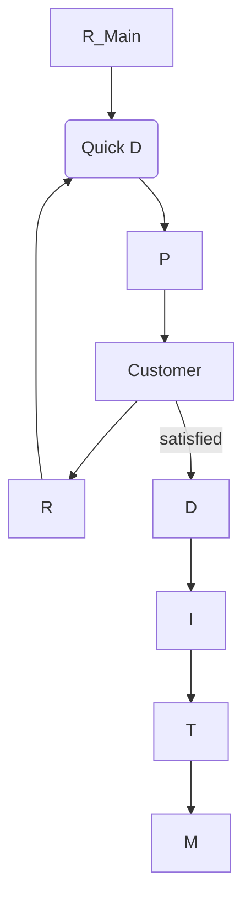

**Demming's Cycle**
**Kanban Board**
UML Software Design
Pytest, Unittest Code
# SDLC 
Exploratory Programming -> Build and fix
1. First Prototype
2. Implement/modify code
3. Think About Changes
4. Back to Step 2

**Problems**
1. Exponential cost, effort, time
2. Large projects, incompatible with teams
3. unmaintanable, no documentation
![[Pasted image 20250301113826.png]]

| Programmes                       | Software Products                         |
| -------------------------------- | ----------------------------------------- |
| small, individual user-developer | large, team of developers, multiple users |
| ad hoc, no UI / Docu             | systematic, UI, documentation             |
Even small changes are critical in the deployed product.
A software engineer needs to work with:
1. Users
2. Customers
3. Domain Experts
4. Other Engineers
5. Software Engineers
**Fundamental Principle of Software Engineering** *Simplification*
6. **Abstraction**: focus on the important thing, ignore other irrelevant/ unnecessary things
7. **Decomposition**: decompose/ break it down into several small and independently solvable problems, which together solve the whole problem

**Software Development Life Cycle**
Why SDLC:
* no coordination -> no success
* adherence -> accurate status reports -> track progress
* -> more likely sucesss
Typical SDLC
1. Feasibility 
	1. Feasibility Study (Business Use)
		1. Financially: what are the costs?
		2. Technically: is it feasible with the technology?
	2. Need to understand customers'
		1. Inputs, Outputs, Processing
		2. Constraints
	3. Get an overall understanding and perform a cost-benefit analysis.
2. **Requirements**:  
	1. Gathering: Understand exact requirements
		1. Collect with
			1. Correctness
			2. Consistency
			3. Unambiguity
		2. Gather
			1. Relevant Sources
			2. Interviews/ Discussions
	2. Analysis + Specification: Specify exact requirements
		1. Resolve Ambiguity
		2. Resolve Contradictions/Inconsistencies
		3. Make SRS (Software Requirements Specification Document)
3. **Design**
	1. High level: Modules with invocation relationships
	2. Detailed (Low level): DSA of each module in detail
	3. SRS -> Architecture (Implementation suitable in some programming language)
4. **Implementation**
	1. Each module is coded
	2. Unit Testing for each module
5. **Integration + System Testing** 
	1. The modules are integrated in steps
	2. At each step, the partially integrated system is tested.
6. **Maintenance** (Development : Maintenance :: 40:60 effort)
	1. Preventive: prevent errors through change (during the development)
	2. Corrective: correct errors discovered after development
	3. Perfective: improve, enhance (implementation or functionalities)
	4. Adaptive: port to a new environment
![[Pasted image 20250301113853.png]]
**SDLC Model**
* Descriptive, diagrammatic model of SDLC, it can help with
1. identifying all activities for development
2. determine precedence among activities
3. divide the life cycles into phases

**Conclusion**
Adopting an SDLC is a fundamental necessity for any (large) software product.

# SDLC Models

| Traditional              | Agile                              |
| ------------------------ | ---------------------------------- |
| Classical Waterfall      | Xtreme Programming                 |
| Iterative Waterfall      | Scrum                              |
| Evolutionary             | Crystal                            |
| Prototyping              | Function Driven Development        |
| Spiral                   | Learn Software Development         |
| Rational Unified Process | Adaptive Software Development      |
|                          | Dynamic Systems Development Method |

Each has its own balance between plan driven and agility. It is not a binary division.
Each organisation has its own Software Development Methodology which prioritises different things.

**Classical Waterfall**
This model moves like a waterfall between the phases. It does not allow revisiting previous phases. It is too idealistic and does not account for defects. Mistakes and defects go undetected until C or T.
1. F
2. R
3. D
4. C
5. T
6. M

**Iterative**
Keep going through cycles with the 6 phases, iteratively.

**Prototype**
Keep building and refining prototypes until customer is satisfied.
A prototype is an inefficient, unreliable toy implementation with limited functionality.

**Evolutionary**
Incremental modules / successive versions. Start by developing the core modules (initial product skeleton) and refine by adding the new functionalities in releases.
![[Pasted image 20250301114019.png]]

| Advantages                            | Disadvantages                                                                |
| ------------------------------------- | ---------------------------------------------------------------------------- |
| Users have partially developed system | Incremental decomposition is difficult, but may be useful for large projects |
| Core modules are thoroughly tested    |                                                                              |
| Helps with user feedback              |                                                                              |

**Iterative-Incremental**
Combine benefits of both Evolutionary and Iterative.
1. Customer feedback
2. Train on earlier releases
3. Tap into new markets
4. Frequent releases -> can solve unanticipated problems

**Spiral**
subsumes aspects of all: four phases repeat spirally (cyclically)
1. Determine the objectives
2. Identify and resolve the risks
3. Development, Validation
4. Review the loop, plan the next one, incorporate customer feedback
Each loop is for a phase of SDLC
5. Enables understanding
6. Reacting to risks in each loop

**Use Cases**

| Model               | Usage                                                    |
| ------------------- | -------------------------------------------------------- |
| Iterative Waterfall | Well Understood Problems                                 |
| Prototype           | Not well understood problems, (user reqs + tech aspects) |
| Evolutionary        | large problems, incremental delivery                     |
| Spiral              | challenging software products, subject to several risks  |

| Plan Driven                 | Agile                     |
| --------------------------- | ------------------------- |
| Process, tools              | Individuals, Interactions |
| Comprehensive documentation | Working software          |
| Contract negotiation        | customer collaboration    |
| Following a plan            | Responding to change      |

**Agile**
1. Values (4)
	1. Simplicity 
	2. Communication (face to face)
	3. Feedback
	4. Aggressiveness
2. Activities (4)
	1. Coding
	2. Testing
	3. Listening
	4. Designing
3. Practices (12)
	1. Planning
	2. Small Releases
	3. Metaphor
	4. Simple Design
	5. Testing
	6. Refactoring
	7. Pair Programming
	8. Collective Ownership
	9. CI/CD
	10. 40 hrs/ week
	11. On-site customer
	12. Coding standards
4. Challenges with plan-driven
	1. lightweight application - heavyweight process
	2. document intensive
	3. less flexible
	4. big bang coding-integration
	5. testing short shifted
	6. one shot delivery
	7. limited opportunity for process improvement
5. Agile Characteristics
	1. Incremental development (several releases)
	2. Planning based on user stories
	3. Each iteration touches all life cycle activities
	4. Testing
	5. Flexible design
	6. Reflection after each cycle
	7. Several technical and customer focused presentation opportunities.
6. TDD: Test driven development
7. Refactoring: Red green blue cycles
	1. Write a failing test (red)
	2. Make it pass (green)
	3. Refactor (blue)

Xtreme Programming -> infinitesimally small iterative waterfalls
![[Pasted image 20250301114113.png]]
**SCRUM**
Sprints of 1-4 weeks with daily stand ups

**CICD Devops**
![[Pasted image 20250301114452.png]]

| Devops                                                | MLOps                                |
| ----------------------------------------------------- | ------------------------------------ |
| Microservice Architecture                             | ML + Dev + Ops                       |
| Communicate + Collaboration                           | Data Acquisition + Initial Modelling |
| Monitoring + Logging                                  | Canary Releases                      |
| Infrastructure as Code, Test and deploy in containers |                                      |

# Estimation

**Software Project**
1. Process: interdependent
2. Project Management
	1. Planning
	2. Monitoring Control

**Estimates**
1. Range, never a single point
2. Is the estimate necessary? What is the use?
3. Estimate != commitment, with time, certainty increases
4. Measure, count, compute, then resort to estimation
5. Aggregate several independent estimates
![[Pasted image 20250301120218.png]]

![[Pasted image 20250301120311.png]]

**Estimation Methods**
1. Function Point Analysis
	1. Count number of functions for each category
	2. Input, Output, Inquiry, Logical, Interface each has Low, Average, High Complexity. Multiply each with the corresponding complexity weights.
	3. Unadjusted Function Point Total =  Total Sum
	4. Adjusted FP = UFP x  Influence Multiplier
	5. Influence Multiplier = 0.65 + (0 to .7 based on 14 system characteristics)
2. Wideband Delphi (Average of Multiple Experts)
	1. Group Discussions
	2. Anonymous Feedback + Opinions
	3. Iterate until consensus
	4. Average of Multiple Experts
	5. easy, inexpensive, expert opinions
	6. difficult to repeat, may not reach consensus, may be biased
# Scheduling
**Scheduling**
1. What (WBS)
2. How much (Size estimate)
3. Dependencies
4. Schedule (Time estimate)

**Project Elements**
1. Project
	1. Functions
		1. Function
		2. Function
	2. Activities
		1. Activity
			1. Activity
				1. Task
		2. Activity
			1. Task

**WBS**
*Work Break Down Structure*
1. Process WBS
	1. Activity oriented R+A, D, T
2. Product WBS
	1. Entity oriented  Interface, Database, etc.
3. Hybrid WBS

Word Package = Task for 1 or 2 people for 1 or 2 weeks

**WBS Methods**
1. Analogy: Use a template of a previous "similar" project
2. Rolling Wave: Start in the first pass with only 1-3 levels, gather requirements and add detail later

**Sequencing**
1. Milestone Chart
2. Gantt Chart
	1. easy to understand or change
	2. vague, does not show interdependency well
3. Network Techniques
	1. Critical Path Method
		1. Critical Path = Longest (in time) path in the precedence network
		2. Slack Time = Latest Start - Earliest Start
		3. Float Time = Earliest Start of  Successor - Earliest Finish
	2. Program Evaluation and Review Technique
![[Pasted image 20250301122131.png]]
A *precedence network* is a graphic model portraying the sequential relationship.

# Requirements Analysis

The need and requirements are usually written up by the customer in a document called RFP (Request for Proposal.)
Most projects feel because
1. Lack of user inputs
2. Incomplete R+S
3. Changing R+S

Requirement: A statement about the proposed system that all stakeholders agree must be made true in order for the customer's problem to be adequately solved.
1. Short concise piece of information
2. All stakeholders agree
3. About the system
4. Helps solve the customer's problem
**Types of Requirements**
5. Business: High level objectives
6. Functional: features / use cases
7. Non-Functional: Ex. quality constraints, tech constraints, process constraints
**Eliminate**
8. Ambiguities
9. Inconsistencies
10. Incompleteness
11. Contradictions
**Quality Requirements**
12. Correct
13. Feasible
14. Necessary
15. Unambiguous
16. Verifiable
17. Prioritized
**Prototyping**
Ex.
* Simplest: *paper prototype*: a set of pics to show users what happens in sequence
* most common: a mock up of the system's UI
**Difficulties in R**
1. Lack of domain or problem understanding
2. Rapidly changing requirements
3. Attempting too much
4. Hard to reconcile conflicting sets of requirements
5. Hard to state reqs precisely

**JAD**
Joint Application Development is based on intensive brainstorming.
1. Appoint an experienced moderator
2. Arrange the attendees around the table
3. Decide on a trigger question
4. Ask each participant to write an answer and pass the paper to their neighbour
# SRS
![[Pasted image 20250301132733.png]]

SRS document is contract between the development team and the customer: 
*Black Box specification*: SRS is called this because internal system details are not mentioned, only the visible behaviour is documented.
SRS should only handle the what, not the how.
1. concise
2. what, not how
3. easy to change/ maintain
4. consistent
5. complete
6. traceable
7. verifiable

**SRS should include**
1. Functional reqs
	1. A set of high level reqs, each takes in some data and outputs some data, and may consist of a set of identifiable functions
2. Non Functional reqs
	1. Those chars which cannot be expressed as functions
		1. Maintainability
		2. Portability
		3. Usability
		4. Reliability
		5. Performance
		6. Human-computer or external system interfaces compatibility
		7. Security
3. Goals
	1. Not checked for compliance, but desirable.
		1. Reusability
		2. Future Functionalities
It can be visualised as a set of functions $\{f_i\}$ each considered as transforming a set of input data corresponding to the output data. 
**Bad SRS**
4. Unstructured
5. Noisy
6. Silent/ Ignorant
7. Overspecification
8. Contradictions
9. Ambiguous
10. Wishful
11. Forward References

**User Stories**
**As a** \[Type of USER\], \[Function to Perform (some goal)\] **so that** \[Business Value (some reason)\]. 

# UML

1. functional requirements are mapped to use cases
2. non-functional reqs can be specified as constraints

![[Pasted image 20250301134622.png]]
**scenario**: particular sequence of actions in a use case
**use case instance**: execution of a scenario.
**Levels of Rigour**
1. Brief
2. Casual
3. Fully-dressed (detailed, structured)
**Use cases**
4. Essential: independent of implementation
5. Concrete: system dependent
**Actor Types**
6. Primary: actor whose goal is accomplished by the use case
7. Supporting: provides service to system
8. Offstage: has interest, but neither primary nor supporting
![[Pasted image 20250301140646.png]]
![[Pasted image 20250301140703.png]]
![[Pasted image 20250301140736.png]]
![[Pasted image 20250301140800.png]]

# Testing 
**Testing Phases V Model**
Lifecycle view that shows relationships between development and test phases.
![[Pasted image 20250301142813.png]]
**Testing Phases**
1. Unit Testing
	1. Writing Test Cases
	2. Framework Usage
	3. Unit Isolation
	4. Mocking/ Stubbing
	5. Regression Testing (After new changes)
	6. Test Coverage
2. Integration Testing (partial subsystems at a time)
	1. Gain confidence in overall integrity
	2. Ensure proper component interactions
3. System Testing (entire deliverable against specs)
	1. Gain confidence in system integrity as a whole
	2. Compliance with functional and non functional reqs
4. Acceptance Testing (testing against user needs, often by user)

Exhaustive vs. Selective Testing.
It is not possible to conduct truly exhaustive testing. It is inappropriate to test by brute force with every possible value.
1. Too much time
2. Impractical
3. Pointless
Instead we must select in a way appropriate to best represent the whole system being tested: coverage.

**Coverage**
Each of the following must be covered by at least one test case, ideally more.
1. Function coverage: each function
2. Statement: each line of code
3. Path: every possible path through code
Path needs more test cases than statement needs more than function.

**Equivalence Classes**
Divide the inputs into groups that will be treated similarly by all algorithms. Only one test per equivalence class needs to be run. The tester needs to understand the required input and how the software may have been designed.
**Combinatorial Explosion**
Every possible combination of every possible system wide equivalence class cannot be tested. Intstead:
1. At least one test with every equivalence class of every individual input
2. All combinations where an input is likely to affect the other
3. Some more random combinations
4. Boundary values
More errors in software are likely to occur at the boundaries of equivalence classes. 

**Test Case**
to get some info about system behaviour
it consists of {Input, Steps, Expected Behaviour}
Info gained:
1. Find Defects
2. Assess Conformance to specs, standards or regulations
3. Find safe scenarios for product use
4. Assess Quality
5. Block Premature Product Releases
6. Help Managers Make Ship/No Ship Decisions
7. Minimise Technical Support Costs

**Scenario**
A possible path through basic and alternate flows of a use case that an actor can take.
A scenario can be usage, growth, or exploratory.
A scenario should be feasible.

**Test Cases**
A test case is an explicit set of instructions designed to detect a particular class of defect in a software system.
Each test case can give rise to many tests (test case instances).

**Test Plan**
Document that contains a complete set of test cases along with other information about the testing process.
Without this documentation, there will be ad-hoc testing and poor quality software.
Test plan should written long before testing starts, ideally right after reqs.
1. Each test case should be identified and classified.
2. Clear Instructions
3. Expected Results
4. Cleanup After Test Case

**Dimensions of Testing**
1. Quality Under Test
	1. Behaviour 
	2. Performance
	3. Usability
	4. Random Behaviour etc.
2. Unit Under Test
	1. Unit Testing
	2. Module 
	3. Integration
	4. System
	5. Acceptance
3. Modality
	1. Manual
	2. Automated
4. Type
	1. Black Box:  Input, Reqs, Events, Outputs
	2. White Box (Glass Box/ Structural): Testers can examine design docs, code, observe run time execution. Methods:
		1. Coverage (Control Flow)
			1. Statement
			2. Branch
			3. Condition
		2. Dataflow: DU Testing, execute each DU-path of each variable
			1. Defining Node (Input/ LHS)
			2. Usage Node (Output/ RHS/ Control)
		3. Mutation: Make small deliberate (incorrect) changes (mutations) in code to assess effectiveness of test suite
		4. Loop Boundary Analysis: Test boundary conditions within loops
		5. Data Dependency: Focus on relationships between different variables
		6. Path Predicate: Analyse predicates (Boolean Expressions)
		7. Combinatorial/ Pairwise: A subset of test cases that cover all possible (valid/invalid) combinations of input parameters
		8. Error Guessing: (Guess Common Mistakes)
		9. Model-based: Create formal model of system behaviour
		10. Static Program Analysis: Ex. Use Static Analysis Tools like pylint to detect potential issues

**(Mccabe's) Cyclomatic Complexity**
$$C = E-V+2$$
Only applies to graphs with binary split at each decision.
Basis Path Testing
1. Draw CFG (Control Flow Graph)
2. Calculate Cyclomatic Complexity, this is the number of test cases
3. Identify Independent Paths
4. Design Test Cases
Structured Testing
Test one selected path in the CFG.

**Unit Testing** 
To ensure
1. Module works
2. Simplifies Integration
3. Documentation
4. Design Improvement/ Spec Clarification

Writing effective unit tests involves
1. Understanding reqs
2. Complex Logic
3. Dependencies (Mocking/ Stubbing)
4. State Management
5. Test Maintainability
6. Performance Overhead
7. False +ves/-ves
8. Test Coverage
9. Testing Edge Cases
10. Maintaining Test Independence

**Integration Testing Strategies** Pros and Cons
1. Big Bang
	1. cannot find issue
	2. avoids cost of scaffolding (stubs)
2. Top Down: start with top level modules and use stubs for lower levels, recursively
	1. Always has a top level system
	2. Stubs can be written easily from interface specs
	3. May delay performance problems until too late
	4. Expensive Stubs
3. Bottom Up: use drivers for upper level modules
	1. Primitive Functions get most testing
	2. Drivers usually cheap
	3. Only have a complete system at the end
4. Critical First
	1. Guarantees that most important components work
	2. Integration may be different
5. Function at a time: integrate all the modules necessary for a function, add one at a time
	1. Easier test generation
	2. May postpone function interactions, dependencies may create problems
6. As Delivered: efficient and lazy, integrate modules as and when ready
7. Sandwich: most common, both top down and bottom up

| **Stub**                       | **Mock**                                                                |
| ------------------------------ | ----------------------------------------------------------------------- |
| Provides fake data.            | Checks if actions happened.                                             |
| Passive ("Here’s a response"). | Active ("Did you call me?").                                            |
| Used for **state testing**.    | Used for **behavior testing**.                                          |
| Ex. if input=123, return 456   | Ex. mock input output which may depend on other complex functionalities |
|                                |                                                                         |
**System Testing**
1. Functional Reqs: Test plan for all reqs, review plan and execute tests, monitor fault rate
2. Performance Reqs: Identify stress points, create/ obtain load generators, Run stress tests, monitor performance

**Acceptance Testing**
by user and clients (accept or reject system)
1. Alpha: under supervision of software dev team
2. Beta: in a normal work env (from potential users)
	1. open beta release: low quality software released to open public

**Shadow Testing**
Compare older (stable) system to new system parallelly

**Test-Fix-Test Cycle**
1. Report into failure tracking system
2. screening, assign priority
3. low priority-> known bugs list, put in software release notes
4. merge related failure reports
5. assign investigator to track and fix defect
6. back to testing before new release

**When to stop testing**
1. All critical (Level 1) test cases must have been successfully executed
2. A predefined percentage of level 2 and lever 3 as well
3. targets must be maintained for at least two cycles of builds

A build is compiling and integrating all components.
Failure rates may fluctuate between builds because
1. diff regression tests
2. new defects introduced

**Test Planning**
1. Decide overall test strategy
2. Decide on coverage strategy for system tests, number of test cases
3. Identify and Implement test cases
4. Identify a subset as regression tests

First pass of unit and integration testing: developer testing
independent testing: expertise, no vested interest in passing as many test cases
# Design
A software design is a solution to a problem. It is language agnostic.
1. Architecture Design
	1. Subsystems, Components, Connections, Interactions, Interfaces
2. Class Design
3. UI Design
4. Algorithm Design
5. Protocol Design

**Fundamental Design Principles**
1. Abstraction
2. Separation of concerns (Decomposition)
	1. A concern is a feature or behavior that is specified as part of the requirements model for the software.
3. Modularity
4. Information Hiding (*Encapsulation*)
	1. The client systemss should not be able to access specific local design decisions. They should only be able to access the controlled interface, which in turn can access the inner workings of the systems. 
5. Refinement
6. Design Classes
7. Functional Independence
	1. High Cohesion: Cohesion refers to interdependence within methods and classes within one module. Unrelated methods and classes should not be in the same module.
	2. Low Coupling: Coupling is interdependence between modules. Changes in one module should not cause cascading changes everywhere.
8. Patterns

![[Pasted image 20250428155058.png]]

# Usability
1. Functional Perspective
2. User Perspective
Usability: the extent of use with effectiveness, efficiency, satisfaction, in achieving specified goals by specified users in a specified context

**Attributes**
1. Learnability: time to learn, happens in plateaus
2. Efficiency (Speed of Performance), refers to speed of UI, often inversely proportional to learnability
3. Memorability (Retention of Skills), affected by how close operation syntax is to our understanding, may be less important if learning is very fast
4. Rate of User Errors (Importance depends on criticality of Software)
	1. Consistency
	2. Instructions
	3. Logical Arrangement of Screens
5. Subjective Satisfaction: how comfortable is the user? not analytical/ objective/ measurable, harder to measure

Design of UI
1. Inside Out (start with system)
2. Outside In (start with UI)

Why is Good UI Design Hard?
1. Takes time
2. thinking like a user, not engineer
3. different users want different things
4. designers are experts, marketing want beginners (novice), most are intermediates

User Profile
1. Work exp.
2. Computer exp.
3. Age
4. Education
5. Reading Skills
6. Language Skills
7. Work Env.
8. Task Freq.
9. Etc.

**Schneiderman's Golden Usability Principles**
1. consistency
2. discoverable, usable, shortcuts
3. feedback to user action
4. yield closure to user action
5. clear approachable error handling
6. undo option, if not undoable, hesitation
7. internal locus of control (customizable, personalisation, user in charge)
8. reduce STM load (short term memory) $7±2$ rule

Usability Guidelines (not mandatory) are statements to determine actions of usefulness.

Usability Labs have testing room and observation room (to observe participant by video, audio, and screen, which are also recorded) 

# Quality
Quality is relative
1. Entity of interest
2. viewpoint
3. attributes we want to assess
4. levels of abstraction

**Quality Attributes**
Totality of features and characteristics that bear on its ability to satisfy stated or implied needs
Types of QAs
1. Business:
	1. Time to Market
	2. Project Lifetime
	3. Cost-Benefit
	4. Integration with Legacy
	5. Target Market
	6. Projected Roll Out
2. System: 
	1. Reliability
	2. Robustness
	3. Efficiency
	4. Usability
	5. Safety
	6. Security
	7. Fault-Tolerance
	8. Correctness
	9. Modifiability
3. Architectural: Conceptual Integrity, Correctness, Completeness, Buildability

UML is only a notation for design, any notation can be used.
**Design Principles** *OO*
1. GRASP (General Responsibility Assignment Software Patterns)
2. Gang of Four Design Patterns

**RDD** (Responsibility Driven Design)
A responsibility is a contract or obligation of a class in terms of its role.
1. Doing: controlling, coordinating, creating, initiating
2. Knowing: calculating, deriving, private encapsulated data, related objects
Responsibility != Method
Methods fulfill responsibilities alone or in collaboration.

**Categories**
1. Setting and Getting Values of Attributes
2. Creating and Initializing New Instances
3. Loading, saving from/to persistent storage
4. destroying instances
5. etc.

**Assigning responsibilities**
1. All responsibilities of a given class should be clearly related
2. Split into distinct classes otherwise
3. No responsibilities = useless
4. Create a new class if the responsibility cannot be attributed to any existing class
5. Use Patterns

**Pattern Types**
1. Reqs Patterns: families of reqs for a family apps
2. Architectural Patterns: families of architectures
3. Design Patterns: families of low level design solutions 
4. Programming Idioms: programming language specific solutions

**Creator**  
- Problem: Who should create an instance of class A?  
- Solution: Assign creation responsibility to class B if:  
  - (1) B contains A  
  - (2) B compositely aggregates A  
  - (3) B has initializing data for A  
  - (4) B records A  
  - (5) B closely uses A  

 **Information Expert**  
- Problem: How to assign responsibilities to objects?  
- Solution: Assign to the class with the most information needed to fulfill the task.  

**Low Coupling**  
- Problem: How to reduce the impact of changes?  
- Solution: Minimize dependencies between classes.  
  - Coupling = Strength of dependencies between classes.  
  - Prefer designs where changes in one class don’t ripple to others.  

**Controller**  
- Problem: How to connect UI to application logic?  
- Solution: Use a Controller layer to mediate between UI (View) and logic (Model).  
- MVC Pattern:  
  - Model: Core logic/data (e.g., `Database`).  
  - View: UI representation (e.g., `WebPage`).  
  - Controller: Handles input/output (e.g., `Router`).  

**Polymorphism**  
- Problem: Who handles behavior that varies by type?  
- Solution: Assign responsibility to the specific class (type) where the behavior differs, using polymorphic methods (e.g., method overriding).  
- Why? Avoids rigid `if-else`/`switch` checks for types.  
- Example:  
  - A `Shape` superclass defines `draw()`, while subclasses (`Circle`, `Square`) implement their own `draw()` logic.  

**Pure Fabrication**  
- Problem: How to assign responsibilities without violating High Cohesion/Low Coupling?  
- Solution: Create an artificial class (not part of the problem domain) to group related behaviors.  
- Why? Maintains design purity when no natural class fits.  
- Example:  
  - A `DatabaseLogger` class (not a real-world entity) handles logging across multiple domain classes.  

**Indirection**  
- Problem: How to reduce direct coupling between components?  
- Solution: Introduce an intermediate object to mediate communication.  
- Why? Decouples components, enabling flexibility.  

**Protected Variations**  
- Problem: How to shield the system from unstable/variable components?  
- Solution: Wrap the variable part with a stable interface (e.g., abstract class, interface).  
- Why? Isolates changes to one module.  
- Example:  
  - A `PaymentInterface` abstracts payment methods (PayPal, Stripe), so changes to one don’t break others.  

# Code Inspection
Detecting errors late in the development cycle is expensive
Multiple stages of defect removal

Inspections ➢ Inspections are formal or informal evaluations of code, aimed at finding defects and improving code quality through collective review. 
1. Code Review
2. Pair Programming
3. Formal Inspections
4. Checklists
5. Static Analysis Tools
	1. SonarQube
	2. Checstyle
	3. PMD
	4. FindBugs
	5. SpotBugs

Examples
1. Null Pointer Exceptions
2. Constant instead of Magic Numbers
3. Index based analysis less efficient than for each loop
4. Duplicate Logic
5. Vulnerability: SQL Injection
6. Not Closing File Pointer: Resource Leak

**Formal Inspection People Involved**
1. Author 
2. Reader
3. Inspector
4. Moderator
5. Scribe

**Other Benefits**
1. Team gets familiar to code
2. Uniformity in Coding Practices
3. Knowledge Sharing
4. Improved Communication and Understanding between team
5. More Perspective of everything comes together

Static Code Analysis (Syntax) ➢ Static code analysis refers to the automated analysis of source code without executing it, focusing on detecting potential errors, code smells, and security vulnerabilities

# UML: Software Modelling
