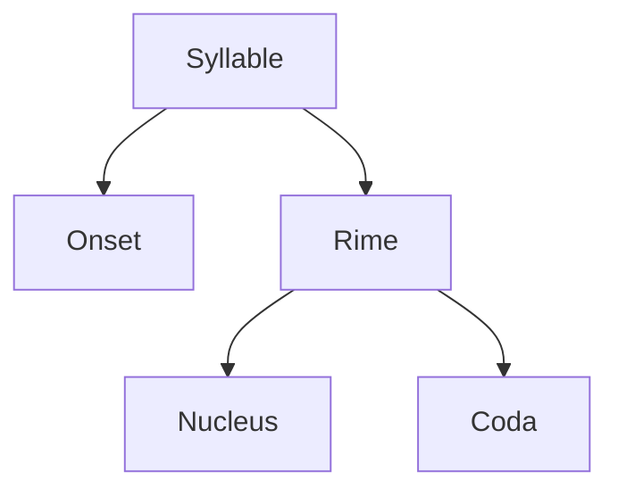

Ergative Absolutive or Nominative Accusative
Design Features of Language
Kaaraka, Thematic Roles, XBar Theory

# Historical Linguistics
# 1 Intro
Historical Linguistics
Comparative Linguistics
Diachronic Study
Synchronic Study
Philology
Etymology
**Kinds of Language Change over time**
1. Lexical
2. Grammatical
	1. Syntactic
	2. Morphological
3. Sound Change
4. Change in Orthography

**Kinds of Language Change over time**
1. **Lexical**: thou is no longer used in common speech, only you is used as a second person pronoun
2. **Grammatical**
	1. **Syntactic**: In Old English, the past participle came at the end of the sentence, and only the auxiliary verb was in the second position. Today all verbs come before all objects.
	2. **Morphological**: Old English past plural conjugation "kamen" and "seiden" lost the "-en" in Modern English "came" and "said". Old English past participles lost the "ge-"
3. **Sound Change**: Ex the word "thou" use to be pronounced "ðu" and is today pronounced "ðau"
4. **Change in Orthography**: Ex. "þu" to "thou" because of Norman conquests
Other forms in Old English include:
5. No auxiliary "do" for negation and interrogative
6. "to be" as an auxiliary for the perfect tense for verbs with motion
7. Using "er" and "est" for all comparatives and superlatives (Ex. unkindest)
# 2 Sound Change
Regularity principle (Neogrammarian Hypothesis) by the Junggrammatiker: "*Sound laws suffer no exception.*"
Relative Chronology
Chain Shifts:
1. Pull chain (making it regular, closing the gap)
2. Push chain (making it more different)
**Sound Change**
3. conditioned vs unconditioned
4. phonemic vs allophonic

**Sound Change**
1. **conditioned vs unconditioned**: conditioned means dependent on phonetic context, unconditioned means everywhere
2. **phonemic vs non-phonemic** (allophonic shifts): phonemic changes affects the number of phonemes, or changes one phoneme to another

**Non Phonemic**
1. Unconditioned: \[ʃu\] > \[ʃʉ\]
2. Conditioned: \[bɛd\] > \[bɛ:d\] (vowels are lengthened only before stops)

**Phonemic Changes**
1. Merger: 
	1. unconditioned: ex. /z/ (\[θ\]), \[s\] -> \[s] in Latin American Spanish
2. Splits: ex. \[mu:s\] -> \[maus\] in English
*Splits follow mergers.*

![[Pasted image 20250228191301.png]]
**Sporadic Changes**
Affecting only one or a few words.
Ex. spr -> sp only in speak and speech but not in sprig, spring, spree etc.

**Assimilation**
One sound becoming more similar to another.
1. progressive vs regressive: progressive affects a later sound, regressive affects a previous sound
2. contact vs non contact
3. total vs partial

**Contact Assimilation**

|                 | Total            | Partial                     |
| --------------- | ---------------- | --------------------------- |
| **Progressive** | myl**n** -> mill | dog**s** -> dog**z**        |
| **Regressive**  | o**c**to -> otto | \*swe**p**-no -> so**m**nus |

**Distant Assimilation**

|                 | Total                      | Partial                |
| --------------- | -------------------------- | ---------------------- |
| **Progressive** | \*pen**kw**e > pen**p**e   | Vowel Harmony          |
| **Regressive**  | \***p**enkwe > **kw**inkwe | m**u**:si -> m**y**:si |

**Dissimilation**
Sounds become less like each other.
Ex. *Grassmann's Law*
bhabhuva -> babhuva
phephuka -> pephuka

**Deletions**

|         | Deletion   | Insertions (Epentheses)                    |
| ------- | ---------- | ------------------------------------------ |
| Initial | Aphaeresis | Prothesis                                  |
| Medial  | Syncope    | Anaptyxis (C**V**C)/ Excrescence (C**C**C) |
| Final   | Apocope    | Paragoge                                   |

**Substitution**
1. Compensatory lengthening: CV -> V: (Ex. tooth from tonθ, da:nt from danta)
2. Rhotacism: s -> r
3. Metathesis: swap of two sounds
4. Haplology: opposite of repetition (Ex. Zauberer but Zauberin)
5. Breaking
6. Final devoicing
7. Intervocalic voicing
8. Nasal assimilation
9. Palatalization
10. Diphtongization
11. Monophtongization
12. Vowel Raising
13. Vowel Lowering
14. Nasalization
15. Lenition (Weakening)
16. Strengthening
17. Gemination
18. Degemination
19. Affrication
20. Spirantization (Fricativization)
21. Deaffrication
22. Lengthening
23. Shortening

**Grimm's Law**
![[Pasted image 20250228211358.png]]
**The English Great Vowel Shift**
![[Pasted image 20250228211606.png]]
# 3 Borrowings

Why do languages borrow words?
1. Need (Lexical Gap): ex tv, phone, computer
2. Prestige (luxury): beef vs cow, pork vs pig, mutton vs sheep
3. Derogatory: ex assassin from arabic hashshashin, habler in french means to boast

Loans as clues to linguistic changes in the past

When languages borrow words, there may be phonological or morphological changes like:
**Phonological Changes**
1. **Adaption** *Phoneme substitution*: due to phonetic interference, the sounds are adapted to the borrowing language
2. **Accommodation** The non-native phonological pattern is retained.
3. *Direct Phonological Diffusion* Non-native phonological patterns are borrowed due to extensive contact with another language.
Words borrowed at different times may have different adaptions, accommodations, or diffusion. Pronunciation may also be based on native orthographies applied to the borrowed word. (Ex jeeppi is pronounced yeppi even though jeep in English does not make that sound)

**Morphological Changes**
1. Retain non-native morphology: ex. lafz -> alfaaz
2. Adapt it to native morphology: ex. bus -> bussein

**Direction of Borrowing**
1. Phonological clues (non native rules)
2. Phonological history
3. Morphological Complexity: (Ex. el lagarto vs alligator, vin aigre vs vinegar, was ist das vs vasista)
4. Clues from Cognates
5. Geographical and ecological clues: Zebra is not native to English range, batata is not native to India originally
6. Other semantic clues: squaw, tomahawk, etc. have semantic associations with indigenous americans

**What can be borrowed?**
1. Borrowed sounds or features in native lexical items
2. Elimination of sounds due to language contact
3. Retention of native sounds due to language contact
4. Shifts in native sounds
5. borrowed phonological rules
6. diffused sound changes
7. Calques (loan translations/ semantic loans): skyscraper in many languages
8. emphatic foreignization
9. cultural inferences

# 4 Analogy
$$\frac ac = \frac bx$$
$$a:b::c:x$$
Analogical change involves a relation of similarity.

**Analogical Extension**
1. Ex. wear was actually a weak verb, but we made it strong wear-wore

**Sturtevant's Paradox**
*Sound change is regular and causes irregularity; analogy is irregular and causes regularity.*

honos
honosis
-> (sound change)
honos
honoris
-> (analogy) 
honor
honoris

**Analogical Models**
1. Immediate: words which are often uttered sequentially or together take up analogies. Ex. kwetwor and penkwe but both become four and five
2. Hypercorrection: pawnded and drownded, to you and I
3. Folk Etymology: Hamburger = ham  + burger -> cheeseburger
4. Back formation: wrongly assumed morphological composition, somewhat folk etymology. cerise = ceri + s -> cherry + s, kitabu -> vitabu
5. Metanalysis / Reanalysis / Amalgamation: a + nadder -> an + adder (the snake). a + napron -> an + apron
6. Blending: (contamination) 
	1. lexical: motel = motor + hotel, brunch, bit = binary + digit, gaydar
	2. syntactic: I'm friends with him = I'm a friend with him + we are friends

# 5 Comparative Method

The aim is to reconstruct an ancestor of a group of languages which have descended from a common language. The process involves comparing cognates to postulate or reconstruct the ancestral language.
*\*Proto Language*
1. The actual spoken language which all the compared languages descended from.
2. The reconstruction obtained by applying the comparative method to a group of related languages.

**Definitions**
1. *Sister Languages*: Languages descended or derived from a common ancestor.
2. *Cognates*: Words in sister languages descended from the same word in the common ancestor.
3. *Cognate Sets*: A set of words in sister languages which have all descended from a word in the common ancestor.
4. *Reflex*: A sound in a sister language is a reflex of the sound it originally descended from in the ancestor. The original sound is reflected by the reflex.
5. *Sound Correspondence Sets*: Sets mapping sounds in each of the sister languages and the original sound in the ancestor language.

**Steps**
1. Assemble Cognates
2. Determine Sound Correspondences
3. Reconstruct the Proto Sound 
	1. determining the directionality
	2. if not clear, then the majority sound is determined to be the original
	3. examine features held in common between the sound correspondence sets
	4. try to preserve economy
		1. phonological fit
		2. typological fit
4. Determine the status of partially overlapping (similar) sound correspondence set
5. phonological fit (with the phonemic inventory of the proto language)
6. typological fit (with language universals and typological rules)
7. reconstruct individual morphemes

**Verner's Law**
![[Pasted image 20250427154208.png]]

**Assumptions**
1. Proto language was uniform without dialectal or social variation
2. Language splits are sudden
3. There is not contact between the languages once they split
4. Sound change is regular

**Limitations**
The comparative method can only reconstruct the proto language as well as the daughter languages preserve the evidence.
If all the daughter languages:
1. Lose or merge formerly contrasting sounds
2. Eliminate earlier alternations through analogy
3. Lose morphological categories
then the reconstructed proto language may not be very accurate.
# 8 Internal Reconstruction
The underlying assumption is that all variants of a morpheme today in a language at one point in the past had a common form. Thus, by comparing forms of a morpheme today, we try to get a single past form, by hypothesising (conditioned) sound changes.

Comparative Method -> Multiple Related Languages -> *\*Proto Language*
Internal Reconstruction -> Multiple Forms in the Same Language -> *\*Pre Language*

Both can be legitimately applied in any order.

**Steps**
1. Identify alternating forms (allomorphs) in different paradigms, derivations, styles, etc.
2. Postulate a single non alternating form.
3. Postulate the changes (usually conditioned sound changes) and relative chronology of the changes.
4. Ensure that the proposed rules do not violate any rules (do not generate non-existing morpheme variants when applied to other morphemes) or typological rules.

**Limitations**
1. Cannot deal with unconditioned phonetic changes
2. If the phonetic environments which the changes were initially conditioned on significantly undergo changes themselves, then there is no longer enough of a context to reconstruct the past form and identify the changes.

# 9 Semantic and Lexical Change

**Semantic Change**
1. Widening:
	1. *dog* initially meant a (specific) powerful breed of dog
	2. *salary* comes from latin, a soldier's allotment of salt, then soldier's wages, and then anyone's wages
	3. *kʌpʌtə* comes from cupboard, which was initially only a board upon which cups and other dishes were placed
2. Narrowing:
	4. *meat* meant food
	5. *hound* meant any dog
	6. *wife* meant any woman
	7. *deer* meant any animal (German *Tier*)
	8. *fowl* meant any bird (German *Vogel*)
	9. *starve* meant to die (German *sterben*)
3. Metaphor: analogy with a leap across semantic domains
	1. *vʌjɾi gɛlːɔ,* *he passed away* means he died
	2. *feuille* means sheet of paper by metaphorical extension from leaf
	3. *root* of word or in algebra from root of plant
	4. *stud* a sexy man, from a male animal used for breeding
4. Metonymy: shift in meaning to include other (often unrelated) meanings (need not be exclusive from Metaphor (or others))
	1. *plata* in Spanish means money as well as the original meaning of silver
	2. *tea* can mean the evening meal
	3. *elope* originally referred to just a married woman running away with a lover
	4. *champagne* comes from the name of the French region
5. Synechdoche: part for whole or whole for part, often considered Metonymy
	1. *Bein* in German originally meant bone
	2. *tongue* or *zubaan* when used to refer to the language itself
6. Displacement or Ellipsis: a word absorbs the meaning of another word it was used with
	1. *private* in American English comes from private soldier
	2. *journal* in French comes from *papier journal* (daily paper)
	3. *hebdomadaire* comes from *magazine hebdomadaire* (weekly magazine)
	4. *intercourse* from sexual intercourse
7. Pejoration (Degeneration)
	1. *knave* means rogue, but originally just boy (German *Knabe*)
	2. *spinster* meant one who spins (and many such words where women are targeted)
8. Amelioration or Elevation
	1. *pretty* meant crafty or sly
	2. *fond* meant foolish or silly
	3. *knight* meant boy or servant
	4. *nice* meant stupid
9. Taboo replacement (avoidance of obscenity)
	1. *huevo* means eggs, but also testicle, because of which people use instead *blanquillo* for egg
	2. *mʰʌjnætʃæ* means monthly to refer to the taboo menstruation
10. Hyperbole (exaggeration)
	1. *terribly, horribly, awfully* 
11. Litotes (exaggeration by understatement)
	1. *bereft* or *bereaved* meant robbed, but was used as a Litotes and now means deprived by death
	2. *poison* in French originally meant potion
12. Due to contact:
	1. *pavo* originally meant peacock, but later took on the meaning of turkey. So, *pavo real* became peacock (In Spanish)
	2. *kono* originally meant bow, but it became gun, and *hintil kono* (old time gun) became bow in K'iche' (Mayan) 

**Explanation for Semantic Shift**
A word with meaning $A$ begins by taking on the meaning $B,$ with $A$ still dominating. Over time, $B$ dominates and takes over and eventually meaning $A$ is lost.
1. Semantically related words often undergo parallel semantic shifts.
2. Phonetic similarity can lead to shifts which leave phonetically similar forms more similar semantically. (confusion and lack of contrast also play a role, as in *sit/set/seat*, *lie/lay*)
3. Spatial/ Locative words may develop temporal senses.
4. Some common shifts happen in particular directions.

**New Words**
1. Root creations (from nothing)
	1. *gas* inspired by Greek chaos.
	2. *paraffin* from *parum* + *affinis* in Latin
2. From names of people
	1. *guillotine* from the physician 
	2. *sandwich* from the Earl of Sandwich
	3. *volt* from the Italian Alessandro Volta
3. From place names
	1. *pfirsich* from Persia (peach)
	2. *denim* from de Nimes
4. From brand names
	1. *google*
	2. *xerox*
5. Acronyms
	1. DJ
	2. BS
	3. OMG
6. Compounding
	4. *Regen + Bogen = Regenbogen*
	5. *Ellen + Bogen = Ellenbogen*
7. Derivational Affixes and processes
	1. *-able : microwaveable*
	2. *post- : postcolonialist*
8. Amalgamation
	1. *usted from Vuestra Merced*
	2. *always from all ways*
9. Clipping (Compressing, shortening)
	1. *bike from bicycle*
	2. *mike from microphone*
10. Expressive Creations
	1. Onomatopoeia 
	2. bodacious, humungous
11. Obsolescence (Loss of vocabulary)
	1. *dorbell*
	2. *dousabell*
	3. *kexy*

# 12 Language Contact
**Areal Linguistics**
The term linguistic area refers to a geographical area in which, due to borrow ing and language contact, languages of a region come to share certain structural features–not only borrowed words, but also shared elements of phonological, morphological or syntactic structure. Linguistic areas are also referred to at times by the terms Sprachbund, diffusion area, adstratum relationship and conver gence area.

**South Asia as a linguistic area**
By Emenau
1. Retroflex consonants
2. Dative subject construction: Ex. *mujhe pata tha*
3. SOV
4. Absence of "*to have*"
5. Conjunctive or Absolutive participles: Ex. mein mandir jaake puja karta hun
6. Morphological causatives: Ex. karna -> karvana
7. Explicator compound verbs: Ex. *kho baithna, le jaanaa*
8. Reduplication : *takka kaam kornu kornu phuro jalle, baccha baccha jaanta hai ki..., dhire dhire kaam ho gaya* (emphasis, every child, gradually)
	1. Partial Reduplication
9. Echo Words : *uppu gippu, oota beeta*
10. Onomatopoeia : *bhow bhow* (Reduplication: phonesthetic forms)
11. Numerals and Quantifiers
	2. Humans vs Animals (eka vs ekLo, doni vs dog, tini vs teg, ondu vs obbaru, erudu vs ibbaru)

# Language Typology (Prompt Engineered)

# 4 Word Order

**1. Definition and Scope**  
- **Word Order Typology**: The study of the linear arrangement of constituents (not just words) in sentences across languages.  
  - Example: *SVO* (Subject-Verb-Object) in English (*"The farmer killed the duckling"*).  
- **Major Parameters**:  
  - Clause order (S, V, O positions).  
  - Noun phrase order (adjective-noun, genitive-noun, relative clause-noun).  
  - Adposition type (prepositions/postpositions).  

**2. Basic Word Order in Clauses**  
- **Six Logical Types**: SOV, SVO, VSO, VOS, OVS, OSV.  
  - **SOV**: Turkish (*"Hasan öküz-ü aldı"* = "Hasan bought the ox").  
  - **VSO**: Welsh (*"Lladdodd y ddraig y dyn"* = "The dragon killed the man").  
  - **VOS**: Malagasy (*"Nahita ny mpianatra ny vehivavy"* = "The woman saw the student").  
  - **OVS**: Hixkaryana (*"Toto yahosiye kamara"* = "The jaguar grabbed the man").  
- **Distribution**: SOV, SVO, and VSO are most common; OSV is rare.  

**3. Challenges in Assigning Basic Word Order**  
- **Free Word Order Languages**: Some languages (e.g., Dyirbal) lack a dominant order; all permutations are grammatical.  
- **Split Systems**:  
  - German: SVO in main clauses (*"Der Mann sah den Jungen"*), SOV in subordinates (*"Ich weiß, daß der Mann den Jungen sah"*).  
  - French: Clitic pronouns precede verbs (*"Le garçon l’a vue"*), full NPs follow (*"Le garçon a vu la jeune fille"*).  

**4. Noun Phrase Word Order**  
- **Adjective-Noun (AN/NA)**:  
  - **AN**: English (*"green table"*), Turkish (*"büyük şehir"* = "large city").  
  - **NA**: French (*"le tapis vert"* = "the green carpet").  
- **Genitive-Noun (GN/NG)**:  
  - **GN**: Turkish (*"kadın-ın çavuğ-u"* = "the woman’s chicken").  
  - **NG**: French (*"la plume de ma tante"* = "the pen of my aunt").  
- **Relative Clause-Head (NRel/RelN)**:  
  - **NRel**: English (*"the potato \[that the man gave\]"*).  
  - **RelN**: Turkish (*"adam-ın kadın-a ver-diğ-i patates"* = "the potato \[that the man gave to the woman\]").  

**5. Adpositions**  
- **Prepositions (Pr)**: English (*"in the house"*), Welsh (*"yn y tỷ"*).  
- **Postpositions (Po)**: Turkish (*"adam için"* = "for the man").  
- **Mixed Systems**: Estonian uses both; Australian languages often lack adpositions entirely.  

**6. Greenberg’s Universals and Correlations**  
- **Key Findings**:  
  - **Universal 1**: Subjects typically precede objects (strong tendency).  
  - **Universal 2**: Prepositional languages usually have NG order; postpositional languages usually have GN.  
  - **Universal 3**: VSO languages are exclusively prepositional.  
  - **Universal 17**: VSO languages tend to place adjectives after nouns.  
- **Implicational Universals**:  
  - Example: If a language is SOV and genitive follows the noun (NG), then adjectives also follow the noun (NA).  

**7. Theoretical Generalizations**  
- **Lehmann’s OV/VO Typology**:  
  - **OV Languages**: Tend to be suffixing, postpositional, with prenominal modifiers (e.g., Turkish).  
  - **VO Languages**: Tend to be prefixing, prepositional, with postnominal modifiers (e.g., English).  
- **Vennemann’s Operator-Operand Theory**:  
  - **Operand-Operator (VO)**: Head precedes dependent (e.g., verb before object, noun before genitive).  
  - **Operator-Operand (OV)**: Dependent precedes head (e.g., object before verb, genitive before noun).  

**8. Critiques and Refinements**  
- **Hawkins’ Complex Implicational Universals**:  
  - Example: *SOV → (AN → GN)* (If a language is SOV and AN, it will also be GN).  
  - SVO languages are less predictable in their correlations.  
- **Limitations**:  
  - Overgeneralizations (e.g., assuming all OV languages are AN).  
  - SVO languages often defy broad typological predictions.  

**9. Value of Word Order Typology**  
- **Methodological Impact**: Greenberg’s work pioneered cross-linguistic empirical typology.  
- **Holistic Typology**: Word order correlates with other features (e.g., morphology, syntax) but is not the sole basis for language classification.  

# 5 Subject

**1. Definition of Subject**  
- The **subject** is a fundamental grammatical relation, central to syntactic analysis across languages.  
- **Prototype definition**: The clearest instances of subjects are those that represent the intersection of **agent** (semantic role) and **topic** (pragmatic role).  
  - Example: In *"The boy kicked the ball,"* *"the boy"* is both the agent (doer of the action) and the topic (what the sentence is about).  
- **Multi-factor and prototype-based**: Subjecthood is not defined by rigid criteria but by a cluster of properties (e.g., case marking, verb agreement, syntactic behavior).  

**2. Challenges in Defining Subject**  
- **Lack of universal agreement**: Different languages assign subject properties differently.  
  - Example: In **ergative languages** (e.g., Chukchi, Dyirbal), the subject of an intransitive verb (S) aligns with the object (P) of a transitive verb in case marking (absolutive), while the transitive subject (A) takes a different case (ergative).  
    - Chukchi:  
      - Intransitive: *Yəm t₂-yet-y'₂ek* ("I came") – *Yəm* (S) is absolutive.  
      - Transitive: *Yəm-nam yat t₂-l'u-yat* ("I saw thee") – *Yəm-nam* (A) is ergative, *yat* (P) is absolutive.  

**3. Syntactic vs. Morphological Subjecthood**  
- **English (nominative-accusative system)**:  
  - Subjects (S and A) are marked alike (nominative), while objects (P) are accusative.  
  - Syntactic tests for subjecthood:  
    - **Verb agreement**: *He sees* (3sg) vs. *I see* (non-3sg).  
    - **Subject-to-object raising**: *I believe Max to be an accountant* (from *I believe that Max is an accountant*).  
- **Dyirbal (ergative-absolutive system)**:  
  - Subjects (S and P) are marked alike (absolutive), while transitive subjects (A) are ergative.  
  - Coordination test: Only S or P can be omitted under coreference.  
    - *Balan d’ugumbil bangul yarangu balgan, banin’u* ("The man hit the woman, and \[the woman\] came") – P (*d’ugumbil*) is omitted, not A (*yarangu*).  

**4. Subject Properties and Semantic/Pragmatic Roles**  
- **Agent-correlated properties**:  
  - Imperatives typically require the addressee to be S or A (high-control roles).  
    - English: *"Come here!"* (S), *"Hit the ball!"* (A).  
    - Dyirbal: Same pattern despite ergative syntax.  
- **Topic-correlated properties**:  
  - **Resultative constructions** (e.g., in Nivkh) often treat S and P alike (focus on the affected entity).  
    - *T'us t'a-yata-d'* ("The meat has been roasted") – P (*t'us*) is the sole argument.  

**5. Mixed and Language-Specific Subject Systems**  
- **Tagalog (Philippine languages)**:  
  - Uses a **focus system** where the subject ("ang-marked") can be either actor (A) or undergoer (P).  
    - Actor-focus: *Bumili ang babae ng baro* ("The woman bought a dress").  
    - Undergoer-focus: *Binili ng babae ang baro* ("The woman bought the dress").  
  - Syntactic processes (e.g., relativization) apply only to the focus noun phrase.  

**6. Subject as a Diffuse Concept**  
- **Continuum of subjecthood**: Not all noun phrases exhibit all subject properties equally.  
  - Example: In *"There is a unicorn,"* verb agreement (*is*) is with *"a unicorn,"* but raising (*I believe there to be a unicorn*) treats *"there"* as the subject.  
- **No strict universality**: Some languages may lack a clear subject category, or distribute subject properties across multiple NPs.  

**7. Theoretical Implications**  
- **Prototype theory**: Subject is a gradient category, with core (agent + topic) and peripheral instances.  
- **Ergativity vs. accusativity**: Languages may mix both systems (e.g., Chukchi uses ergative morphology but nominative syntax in infinitives).  

# 6 Case Marking

**1. Primary Functions of Case Marking**
- **Discriminatory Function**: Cases distinguish between core arguments (A, P, S) to avoid ambiguity, especially in transitive constructions with two NPs.  
  - Example: Ergative-absolutive systems mark A (ergative) to distinguish it from P (absolutive), while nominative-accusative systems mark P (accusative) to distinguish it from A (nominative).  
- **Semantic/Pragmatic Roles**: Cases may correlate with semantic roles (e.g., locative for location) or pragmatic roles (e.g., topic/focus in Japanese/Tagalog).  

**2. Typology of Case Systems**
Five logically possible systems for marking S, A, P:  
1. **Nominative-Accusative**: S = A (unmarked), P marked (accusative).  
   - Example: Latin *puer* (NOM) *puellam* (ACC) *amat* (‘the boy loves the girl’).  
2. **Ergative-Absolutive**: S = P (unmarked), A marked (ergative).  
   - Example: Basque *gizonak* (ERG) *neska* (ABS) *ikusi du* (‘the man saw the girl’).  
3. **Tripartite**: Distinct markers for S, A, P (rare).  
   - Example: Wanggumara (Australian) uses three distinct cases.  
4. **Neutral**: No case marking (reliance on word order/agreement).  
5. **A/P–S**: A = P marked, S unmarked (extremely rare; e.g., Roshani).  

**Functional Explanation**:  
- Transitive constructions require A/P distinction; intransitives do not.  
- Tripartite systems are "overmarked" (distinguishing S unnecessarily), while A/P–S systems are dysfunctional (failing to distinguish A/P).  

**3. Differential Case Marking (DCM)**
Case marking splits based on **animacy** or **definiteness**:  
- **Animacy Hierarchy**: 1st/2nd pronouns > humans > animals > inanimates.  
  - Example:  
    - Dyirbal (Australian): Accusative only for pronouns (*ŋad’a* ‘I-NOM’ vs. *ŋayguna* ‘me-ACC’).  
    - Russian: Genitive-like accusative for animates (*mal’čika* ‘boy-ACC’ vs. *stol* ‘table-NOM/ACC’).  
- **Definiteness**: Accusative marks definite Ps.  
  - Example:  
    - Turkish: *öküz-ü* (ACC, ‘the ox’) vs. *öküz* (‘an ox’).  
    - Persian: *ketāb-rā* (ACC, ‘the book’) vs. *ketāb* (‘a book’).  

**Interaction of Animacy and Definiteness**:  
- Hindi: *ko* marks human Ps (regardless of definiteness) and definite non-human Ps (*bacce-ko* ‘child-ACC’ vs. *patr* ‘letters’).  
- Spanish: Preposition *a* marks human, definite Ps (*al empleado* ‘the clerk-ACC’ vs. *un empleado* ‘a clerk’).  

**4. Inverse Marking**
Verb morphology signals animacy hierarchy reversals (A < P).  
- Example: Algonquian (Fox):  
  - Direct (*-aa*): A > P (*ne-waapam-aa-wa* ‘I see him’).  
  - Inverse (*-ek*): P > A (*ne-waapam-ek-wa* ‘he sees me’).  

**5. Definiteness Continuum**
Definiteness is gradient, not binary:  
1. **Fully identifiable** (e.g., English *the book*).  
2. **Definite superset** (e.g., Persian *yeki az ānhā-rā* ‘one of them-ACC’).  
3. **Relevant but non-specific** (e.g., Turkish *bir öküz-ü* ‘an ox-ACC’ implies discourse relevance).  

**6. Key Universals**
- **Greenberg’s Universal 38**: The case marking S is always the least marked (often zero).  
  - Counterexample: Mojave (Yuman) marks nominative (*-é*) but leaves accusative unmarked.  
- **Ergative Splits**: Ergative case often marks low-animacy As (e.g., Australian languages).  
- **Accusative Splits**: Accusative case often marks high-animacy/definite Ps (e.g., Slavonic, Turkic).  

**7. Summary**
- Case systems prioritize **functional efficiency** (distinguishing A/P).  
- **Animacy** and **definiteness** are key parameters for splits.  
- Cross-linguistic patterns reveal universal tendencies (e.g., unmarked S, accusative for salient Ps).  

**Examples of Split Systems**:  
- **Ritharngu (Australian)**:  
  - Nominative-accusative (pronouns).  
  - Tripartite (humans/intelligent animals).  
  - Ergative-absolutive (other nouns).  
- **Hindi**: *ko* marks humans/definites, reflecting animacy > definiteness hierarchy.  

#  7 Relative Clauses

**1. Definition of Relative Clause**
A relative clause is a subordinate clause that modifies a noun (the **head noun**) by providing additional information about it. It consists of:
- A **head noun** with a potential range of referents.
- A **restricting clause** that narrows down the referents by specifying a proposition that must be true of them.

**Example (English):**  
- "The man \[who bought the book\] left."  
  - Head: "the man"  
  - Restricting clause: "who bought the book" (limits the referent to the man who performed the action).

**Example (Turkish, non-finite):**  
- "\[Hasan-ın Sinan-a ver-diğ-i\] patates"  
  - Literal: "the potato of Hasan's giving to Sinan"  
  - Functionally equivalent to: "the potato that Hasan gave to Sinan."

---

**2. Types of Relative Clauses**
**(a) Restrictive vs. Non-Restrictive**
- **Restrictive:** Essential for identifying the referent.  
- **Non-Restrictive:** Provides extra, non-essential information.  

**(b) Embedded vs. Adjoined**
- **Embedded:** The relative clause is a constituent of the main clause (e.g., English, Turkish).  
- **Adjoined:** The relative clause is attached loosely to the main clause (e.g., Walbiri: "I speared the emu \[it was drinking water\]").  

---

**3. Typological Parameters**
**(a) Word Order**
- **Postnominal:** Relative clause follows the head (English: "the book \[that I read\]").  
- **Prenominal:** Relative clause precedes the head (Turkish: "\[Hasan-ın verdiği\] kitap").  
- **Circumnominal (Internal Head):** Head appears inside the relative clause (Bambara):  
  - "n ye so min ye" → "the house that I saw."  

**(b) Encoding the Head’s Role in the Relative Clause**
Four major strategies (from most to least explicit):
1. **Non-Reduction:** Full noun phrase remains (Bambara, Diegueño).  
2. **Pronoun-Retention:** Pronoun marks the role (Persian, non-standard English):  
   - "the road \[which I don’t know where *it* leads\]."  
3. **Relative Pronoun:** Moved pronoun with case marking (Russian, German):  
   - "devuška, \[kotoruju ja videl\]" ("the girl whom I saw").  
4. **Gap:** No overt marker (English "the man \[I saw\]").

**Functional Principle:**  
Languages tend to use more explicit strategies (e.g., pronoun-retention) for harder-to-relativize positions (e.g., possessors).

---

**4. Accessibility Hierarchy**
A universal hierarchy governs which noun phrases can be relativized:  
**Subject > Direct Object > Non-Direct Object > Possessor**  

**Implication:** If a language can relativize a lower position, it can relativize all higher ones.  
- **Malagasy:** Only subjects.  
- **Kinyarwanda:** Subjects and direct objects.  
- **English:** All positions.  

**Exceptions:** Some Austronesian languages (e.g., Malay) allow relativization of possessors but not direct objects, violating the hierarchy.  

**Workaround:** Use voice alternations to promote noun phrases to accessible positions (e.g., passive in Malay: "kawan \[yang dipukul oleh Ali\]" = "friend \[who was hit by Ali\]").

---

**5. Constraints in Complex Sentences**
- **Subordinate Clauses:** Relativizing non-subjects is often easier than subjects:  
  - English: "the girl \[you think (*that) __ loves me\]" (ungrammatical with "that").  
  - Hungarian: Subordinate subjects cannot be relativized.  

**Puzzle:** No clear explanation for why non-subjects are easier.

---

**6. Functional Explanations**
- **Explicitness:** Harder-to-relativize positions require clearer marking (e.g., pronoun-retention for possessors).  
- **Processing:** Gaps are acceptable where context easily retrieves the role (e.g., English rigid word order).  

# 8 Causatives

**1. Definition of Causative Constructions**
- A **causative construction** expresses a complex macro-situation consisting of two micro-situations:  
  - **Cause**: The event or action that brings about the effect.  
  - **Effect (Result)**: The event or state resulting from the cause.  
- Example:  
  - Cause: *The bus didn’t come.*  
  - Effect: *I was late for the meeting.*  
  - Causative construction: *The bus’s failure to come caused me to be late for the meeting.*

**2. Formal Parameters of Causative Constructions**
Causative constructions can be classified into three main types based on formal (morphological and syntactic) criteria:

**a. Analytic Causatives**
- **Definition**: The causative and the effect are expressed by separate predicates.  
- **Example**:  
  - English: *I caused John to go.* (Separate verbs: *cause* and *go*)  
  - Russian: *Ja adalah tak, čtoby Džon ušel.* (Unnatural: "I did thus, so that John left.")  

**b. Morphological Causatives**
- **Definition**: The causative is formed by adding morphological markers (e.g., affixes) to the non-causative verb.  
- **Characteristics**:  
  - Productive (can apply to most verbs).  
  - Example (Turkish):  
    - *öl* ("die") → *öl-dür* ("kill")  
    - *göster* ("show") → *göster-t* ("cause to show")  
  - Iterative causatives are possible but limited (e.g., *öl-dür-t* "cause to kill").  

**c. Lexical Causatives**
- **Definition**: The relationship between the causative and non-causative verb is unsystematic (suppletive or idiosyncratic).  
- **Examples**:  
  - English: *die* (intransitive) vs. *kill* (transitive, causative).  
  - Russian: *umeret’* ("die") vs. *ubit’* ("kill").  

**3. Semantic Parameters**
**a. Direct vs. Indirect Causation**
- **Direct causation**: Cause and effect are closely linked (e.g., *Anton broke the stick*).  
- **Indirect causation**: Cause and effect are temporally or logically distant (e.g., *Anton brought it about that the stick broke*).  
- **Continuum**: Analytic causatives tend to express indirect causation, while morphological/lexical causatives express direct causation.  

**b. Degree of Control by the Causee**
- **Definition**: The extent to which the causee (the entity caused to act) retains control over the action.  
- **Examples**:  
  - Hungarian:  
    - *kőhögtetem a gyerek-et* (ACC, low control: "I made the child cough").  
    - *kőhögtetem a gyerek-kel* (INSTR, high control: "I got the child to cough").  
  - Japanese:  
    - *Taroo ga Ziroo o ik-ase-ta* (ACC, low control: "made go").  
    - *Taroo ga Ziroo ni ik-ase-ta* (DAT, high control: "got to go").  

**4. Valency Changes in Morphological Causatives**
- **General Rule**: The valency of the causative verb increases by one (the causer is added).  
- **Encoding the Causee**:  
  - **Hierarchy of Grammatical Relations**: Subject > Direct Object > Indirect Object > Oblique Object.  
    - The causee is demoted to the next available position.  
  - **Examples (Turkish)**:  
    - Intransitive verb: Causee becomes direct object.  
      - *Hasan öl-dü* ("Hasan died") → *Ali Hasan-ı öl-dür-dü* ("Ali killed Hasan").  
    - Transitive verb: Causee becomes indirect object.  
      - *Müdür mektub-u imzala-dı* ("The director signed the letter") → *Dişçi mektub-u müdür-e imzala-t-tı* ("The dentist made the director sign the letter").  
    - Ditransitive verb: Causee becomes oblique (e.g., *tarafından* "by").  

**5. Interaction of Formal and Semantic Parameters**
- **Syntactic Approach**: Focuses on grammatical relations (e.g., hierarchy of subject/object).  
- **Semantic Approach**: Focuses on control (e.g., accusative = low control, dative/instrumental = high control).  
- **Combined Analysis**: Both approaches are necessary to explain cross-linguistic variation.  

**6. Additional Notes**
- **Permissive vs. True Causative**: Some languages use the same construction for both (e.g., Georgian *a-cer-in-eb-s* can mean "make/let write").  
- **Suppletive Pairs**: Lack morphological regularity (e.g., *fall* vs. *fell* in English, restricted to "cause trees to fall").  

**Key Takeaways**
1. Causative constructions combine a cause and an effect into a single macro-situation.  
2. They can be analytic, morphological, or lexical, with varying degrees of productivity.  
3. Semantic distinctions (direct/indirect causation, causee control) interact with formal encoding.  
4. The syntactic hierarchy (subject > object > oblique) explains cross-linguistic patterns in causee marking.  
5. Typological studies require both formal and semantic analyses for a complete understanding.  

**Examples**

| Language  | Non-Causative | Causative | Type |
|-----------|--------------|-----------|------|
| Turkish   | *öl* ("die") | *öl-dür* ("kill") | Morphological |
| English   | *die*        | *kill*    | Lexical |
| French    | *courir* ("run") | *faire courir* ("make run") | Analytic-Morphological Hybrid |
| Japanese  | *sin-* ("die") | *sin-ase-* ("cause to die") | Morphological |  

# 9 Animacy
**1. Definition of Animacy**
- **Animacy** is a conceptual hierarchy that ranks entities based on their perceived vitality or agency. The primary hierarchy is:  
  **Human > Animal > Inanimate**  
  - Some languages use broader distinctions (e.g., human vs. non-human, animate vs. inanimate), while others employ finer gradations.  
  - Example: In Finnish, pronouns distinguish humans (*hän* ‘he/she’) from non-humans (*se* ‘it’).  

**2. Linguistic Manifestations of Animacy**
Animacy influences various linguistic structures, often overriding grammatical rules. Key areas include:  

**A. Case Marking**
- **Accusative Case Splits**: Many languages mark accusative case only for high-animacy nouns (e.g., pronouns, humans).  
  - Example:  
    - Russian: Uses a genitive-like accusative for animate nouns (*viděl studenta* ‘saw the student’ vs. *viděl stol* ‘saw the table’).  
    - Hindi: Postposition *ko* marks animate/definite objects (*larkē-ko dekʰā* ‘saw the boy’).  

**B. Number Distinctions**
- High-animacy nouns (e.g., pronouns, kin terms) often obligatorily mark number, while low-animacy nouns may lack it.  
  - Example:  
    - Mandarin: Pronouns distinguish number (*wǒ* ‘I’ vs. *wǒmen* ‘we’), but most nouns do not (*péngyou* ‘friend(s)’).  
    - Chukchi: Only pronouns and proper names have obligatory plural marking.  

**C. Pronominal Systems**
- Many languages use distinct pronouns for humans/non-humans or animates/inanimates.  
  - Example:  
    - English: *who* (human) vs. *what* (non-human).  
    - Russian: *kto* (animate) vs. *čto* (inanimate).  

**D. Verb Agreement**
- Verbs may agree with higher-animacy arguments, even if they are not the grammatical subject.  
  - Example:  
    - Chukchi: In ditransitives, agreement prioritizes recipients over patients if the recipient is 1st/2nd person (*na-yəl-ɣəm* ‘they gave to me’).  
    - Southern Tiwa: Passive is required if a 1st/2nd person outranks the agent (*te-mu-che-ban* ‘I was seen by the man’).  

**E. Voice Alternations**
- Some languages require passive voice when the patient outranks the agent in animacy.  
  - Example:  
    - Navaho: *bi-* prefix marks passive when P > A in animacy (*bi-dilid* ‘the potato burnt the girl’).  

**3. Extensions of the Animacy Hierarchy**
Animacy is not strictly biological but includes:  
- **Pronouns**: Treated as higher than non-pronouns, even if inanimate (*Russian ono* ‘it’ still takes genitive-accusative).  
- **Proper Names/Kin Terms**: Often rank higher than common nouns (e.g., Chukchi reindeer names treated like human names).  
- **Social Factors**: Some languages rank male/adult humans higher (e.g., early Slavonic excluded women/children from special accusative).  

**4. Challenges to Animacy as a Single Hierarchy**
- **Cross-Cutting Features**: Distinctions like pronoun/non-pronoun or proper/common noun do not align neatly with literal animacy.  
- **Interaction with Other Parameters**: Animacy often combines with definiteness, topicality, or individuation.  
  - Example: Hindi *ko* marks both animate and definite objects.  

**5. Theoretical Explanations**
- **Topic-Worthiness**: Correlates with animacy but fails to explain 1st/2nd person symmetry (e.g., no consistent ranking between *I* and *you*).  
- **Salience/Individuation**: Explains why named/definite entities rank higher but clashes with plural/singular mismatches.  
- **Conclusion**: Animacy reflects a cluster of interacting factors (literal animacy, definiteness, individuation) rather than a single linear scale.  

**6. Examples of Fine-Grained Distinctions**
- **Animals**: Some languages rank mammals > insects (Ritharngu) or use continua (Yidiny).  
- **Inanimates**: Navaho ranks spontaneously moving entities (wind, lightning) above others.  

### **Wernicke’s Area vs. Broca’s Area**  

| Feature               | **Wernicke’s Area**                          | **Broca’s Area**                          |
|-----------------------|---------------------------------------------|------------------------------------------|
| **Location**          | Posterior part of the **left temporal lobe** (near the auditory cortex). | Posterior part of the **left frontal lobe** (near motor cortex). |
| **Function**          | - Language **comprehension** (understanding speech/written language). - Semantic processing. | - Speech **production** (articulation, grammar, fluency). - Motor planning for speech. |
| **Associated Aphasia** | **Wernicke’s Aphasia** (Receptive aphasia). | **Broca’s Aphasia** (Expressive aphasia). |
| **Speech Symptoms**   | - Fluent but **nonsensical speech** (word salad). - Poor comprehension. - Neologisms (made-up words). | - **Non-fluent, effortful speech**. - Omitted function words (telegraphic speech). - Intact comprehension. |
| **Example**          | *"The glipzorp is fluming the zogwatt."* (Grammatical but meaningless). | *"Walk... dog... park..."* (Meaningful but fragmented). |
| **Neurological Basis** | Damage disrupts **semantic processing**. | Damage disrupts **motor speech planning**. |

---

**Aphasia: Definition and Types**  
**Aphasia** is a language disorder caused by brain damage (e.g., stroke, trauma) that impairs speech production, comprehension, reading, or writing.  

**Major Types of Aphasia**  
1. **Wernicke’s Aphasia (Receptive Aphasia)**  
   - **Cause:** Damage to Wernicke’s area.  
   - **Symptoms:**  
     - Fluent but meaningless speech.  
     - Poor comprehension (cannot understand others).  
     - **No awareness** of errors.  

2. **Broca’s Aphasia (Expressive Aphasia)**  
   - **Cause:** Damage to Broca’s area.  
   - **Symptoms:**  
     - Non-fluent, halting speech.  
     - **Good comprehension** but difficulty forming sentences.  
     - Frustration due to awareness of errors.  

3. **Global Aphasia**  
   - **Cause:** Damage to **both Broca’s and Wernicke’s areas** (e.g., large left-hemisphere stroke).  
   - **Symptoms:**  
     - Severe impairment in **all language functions** (speech, comprehension, reading, writing).  

4. **Conduction Aphasia**  
   - **Cause:** Damage to the **arcuate fasciculus** (connection between Broca’s and Wernicke’s areas).  
   - **Symptoms:**  
     - Fluent speech but **frequent phonemic paraphasias** (e.g., "television" → "televilion").  
     - **Poor repetition** despite intact comprehension.  

5. **Anomic Aphasia**  
   - **Cause:** Damage to **angular gyrus** or temporal lobe.  
   - **Symptoms:**  
     - Difficulty finding words (**anomia**).  
     - Speech is fluent but **circumlocutory** (e.g., "thing you write with" for "pen").  

# Morphological Typology  
- **Analytic:** Isolated morphemes (Chinese, Vietnamese).  
- **Agglutinative:** Morphemes glued clearly (Turkish, Japanese).  
- **Fusional:** Morphemes fused ambiguously (Latin, Russian).  
- **Polysynthetic:** Sentence-like words (Inuktitut, Mohawk).  

**Note:** Most languages are mixed (e.g., English is fusional but trending analytic; Japanese is agglutinative in verbs but analytic in nouns).  

# Phonological Typology
 **Vowels**
 1. Tongue Height: closed/ high (i, u), open/low (a)
 2. Tongue Retraction: back (*a, o, u*), front (*i, e*)
 3. Rounding: Rounded or Unrounded etc. (Protruded, Compressed)
 4. Nasality: Nasal or Oral
 5. Phonation: Voicing, Creaky, Breathy, etc
 6. Tone

**Consonants**
1. Place of Articulation
2. Manner of Articulation
3. VoT (Voice Onset Time)
4. Airstream Mechanism (Click, Pulmonic Egressive, Implosive/Ingressive etc.)
5. Length

**Syllable Structure** $\sigma$

**Universals**
A linguistic universal is a pattern that occurs systematically across natural languages, potentially true for all of them.
They may be
1. Absolute (Exceptionless) or Statistical (Probabilistic Tendencies)
2. Implicational (Apply to a subset of languages) or Non-Implicational (Apply to all languages)
	1. Implicationals may be
		1. Unidirectional
		2. Bidirectional
3. Formal (grammatical constraints) or Substantive (Categories Present)
Greenberg's Universals were a set of 46 universals, mainly about Syntax and Morphology.

**Design Features of Language**

| Feature                      | Definition                             | Example                        | Present in Animal Communication?  |
| ---------------------------- | -------------------------------------- | ------------------------------ | --------------------------------- |
| **Vocal-Auditory**           | Speech via sound/hearing               | "Hello"                        | Some (e.g., bird songs)           |
| **Broadcast/Directional**    | Sound spreads but is localized         | Locating a speaker             | Yes (e.g., wolf howls)            |
| **Rapid Fading**             | Speech disappears quickly              | Words fade after being spoken  | Yes                               |
| **Interchangeability**       | Speakers can send/receive same signals | Saying & understanding "run"   | Limited (e.g., bee dances)        |
| **Total Feedback**           | Self-monitoring of speech              | Correcting mispronunciations   | Rare                              |
| **Specialization**           | Signals for communication only         | "Fire!" as a warning           | Some (e.g., vervet monkey alarms) |
| **Semanticity**              | Words have meanings                    | "Tree" = a plant               | Limited (e.g., specific calls)    |
| **Arbitrariness**            | No natural sound-meaning link          | "Cat" vs. "gato"               | Some (e.g., arbitrary bird calls) |
| **Discreteness**             | Distinct sound units                   | /p/ vs. /b/ in "pat" vs. "bat" | Rare                              |
| **Displacement**             | Talking about absent things            | "Tomorrow’s meeting"           | Very rare (e.g., bee dances)      |
| **Productivity**             | Infinite new sentences                 | Creating novel phrases         | No                                |
| **Traditional Transmission** | Learned culturally                     | Child learns native language   | Partial (e.g., birdsong dialects) |
| **Duality of Patterning**    | Sounds → meaningful units              | /k/+/æ/+/t/ = "cat"            | No                                |
| **Prevarication**            | Lying/fiction                          | "I saw a ghost"                | No                                |
| **Reflexiveness**            | Talking about language                 | "This sentence is false."      | No                                |
| **Learnability**             | Adaptable over time                    | Slang, new words               | Limited                           |
